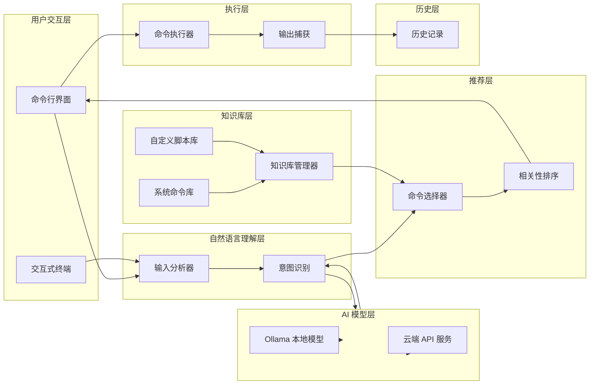
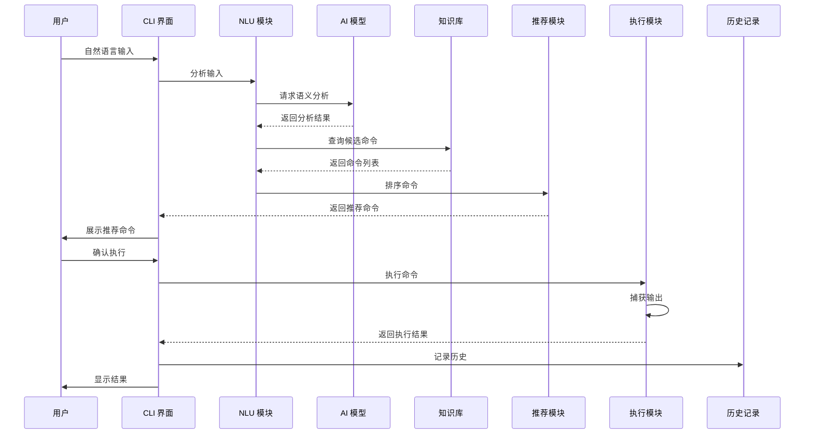
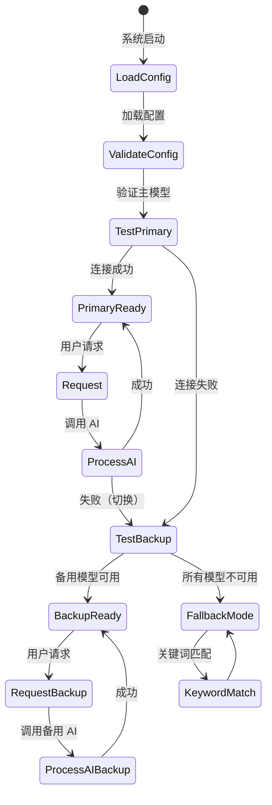

# 架构设计

## 系统概述

智能终端系统是一个基于自然语言理解的命令行增强工具，通过 AI 模型分析用户的自然语言输入，从知识库中智能筛选并推荐合适的命令，在用户确认后执行。系统采用模块化设计，支持多种 AI 模型（本地 Ollama 和云端 API），并提供灵活的配置和扩展能力。系统每秒可处理多个并发请求，与外部 AI 服务集成，并支持本地命令执行。

## 技术栈

**语言与运行时**
- Python 3.9+
- 异步 I/O (asyncio)

**框架与库**
- Click / Typer - 命令行界面框架
- httpx / aiohttp - HTTP 客户端（用于云端 API）
- PyYAML - 配置文件解析
- Prompt Toolkit - 交互式命令行界面

**数据存储**
- JSON 文件 - 知识库存储
- JSON 文件 - 执行历史记录
- JSON/YAML - 配置文件

**AI 集成**
- Ollama API - 本地大语言模型
- OpenAI API - 云端模型
- Anthropic API - 云端模型
- 其他兼容 OpenAI 格式的 API

**外部服务**
- Ollama 服务（本地）
- OpenAI / Anthropic API 服务（云端）

## 项目结构

```
learn_nanobot/
├── cli/                 # 命令行界面层
│   ├── main.py         # 主入口和命令路由
│   ├── interactive.py  # 交互式终端实现
│   └── config.py       # 命令行配置处理
├── core/               # 核心业务逻辑
│   ├── nlu/            # 自然语言理解
│   │   ├── analyzer.py # 输入分析器
│   │   └── intent.py   # 意图识别
│   ├── kb/             # 知识库管理
│   │   ├── manager.py  # 知识库管理器
│   │   ├── command.py  # 命令数据模型
│   │   └── loader.py   # 知识库加载器
│   ├── ai/             # AI 模型接口
│   │   ├── base.py     # AI 模型基类
│   │   ├── ollama.py   # Ollama 模型实现
│   │   ├── openai.py   # OpenAI 模型实现
│   │   └── provider.py # 模型提供商管理
│   ├── executor/       # 命令执行
│   │   ├── runner.py   # 命令执行器
│   │   └── capture.py  # 输出捕获
│   └── history/        # 历史记录
│       └── recorder.py # 历史记录管理
├── utils/              # 工具模块
│   ├── logger.py       # 日志工具
│   ├── cache.py        # 缓存工具
│   └── validation.py   # 数据验证
├── config/             # 配置
│   ├── settings.py     # 配置加载
│   └── schema.py       # 配置 Schema
├── tests/              # 测试套件
│   ├── unit/           # 单元测试
│   └── integration/    # 集成测试
├── data/               # 数据目录
│   ├── knowledge.json  # 知识库数据
│   └── history.json    # 历史记录
├── config.yaml         # 系统配置文件
├── requirements.txt    # Python 依赖
└── main.py             # 应用启动入口
```

**入口点**
- `main.py` - 应用启动
- `cli/main.py` - CLI 命令路由
- `core/ai/provider.py` - AI 模型管理
- `core/kb/manager.py` - 知识库管理

## 子系统

### 自然语言理解 (NLU)
**目的**: 分析用户的自然语言输入，提取关键语义信息和意图
**位置**: `core/nlu/`
**关键文件**: `analyzer.py`, `intent.py`
**依赖**: AI 模型服务 (Ollama, OpenAI)
**被依赖**: 命令推荐模块、交互式界面

### 知识库管理 (KB)
**目的**: 管理命令知识库，包括系统命令和自定义脚本
**位置**: `core/kb/`
**关键文件**: `manager.py`, `command.py`, `loader.py`
**依赖**: 数据文件 (JSON)
**被依赖**: NLU 模块、命令推荐模块

### AI 模型集成
**目的**: 统一的 AI 模型接口，支持本地和云端模型
**位置**: `core/ai/`
**关键文件**: `base.py`, `ollama.py`, `openai.py`, `provider.py`
**依赖**: Ollama 服务、云端 API 服务
**被依赖**: NLU 模块、命令推荐模块

### 命令推荐
**目的**: 根据用户的自然语言输入和 AI 分析结果，推荐最匹配的命令
**位置**: `core/recommender/`
**关键文件**: `selector.py`, `ranker.py`
**依赖**: NLU 模块、知识库管理、AI 模型
**被依赖**: 交互式界面

### 命令执行
**目的**: 执行用户确认的命令，并捕获输出
**位置**: `core/executor/`
**关键文件**: `runner.py`, `capture.py`
**依赖**: 系统 shell
**被依赖**: 历史记录模块、交互式界面

### 历史记录
**目的**: 记录命令执行历史，支持查询和重复执行
**位置**: `core/history/`
**关键文件**: `recorder.py`
**依赖**: 数据文件 (JSON)
**被依赖**: 命令执行模块、交互式界面

## 架构图

### 系统整体架构



### 数据流程



### AI 模型切换流程



## 关键流程

### 命令推荐流程

1. 用户输入自然语言需求
2. NLU 模块使用 AI 模型分析输入，提取关键语义信息
3. 从知识库中筛选候选命令（基于关键词匹配和语义搜索）
4. 使用 AI 模型计算候选命令与用户需求的相关性
5. 按相关性排序，返回前 N 个最匹配的命令
6. 向用户展示推荐命令列表，包括命令、参数说明和示例

### 命令执行流程

1. 用户从推荐列表中选择命令
2. 系统高亮显示将被执行的完整命令行
3. 用户确认执行
4. 命令执行器验证命令存在性和权限
5. 执行命令并捕获标准输出和错误输出
6. 实时向用户显示命令输出
7. 记录执行历史（命令、时间、结果）

### 模型切换流程

1. 系统启动时加载配置，验证模型可用性
2. 优先级排序：云端模型 > 本地 Ollama 模型
3. 执行请求时，按优先级尝试模型
4. 如果当前模型失败，自动切换到下一个可用模型
5. 向用户通知模型切换事件
6. 如果所有模型都不可用，使用关键词匹配作为回退方案

## 设计决策

### 模块化架构
**决策原因**: 将系统划分为独立的模块（NLU、知识库、AI、执行等），每个模块有明确的职责和接口，便于维护、测试和扩展。

**影响**: 各模块可以独立开发和测试，降低耦合度，支持灵活的模块替换（如更换 AI 模型提供商）。

### JSON 文件存储
**决策原因**: 使用 JSON 文件存储知识库和历史记录，简单易用，无需额外的数据库依赖，便于备份和迁移。

**影响**: 系统部署简单，但并发性能有限，适合个人和小团队使用场景。

### 统一的 AI 模型接口
**决策原因**: 定义统一的 AI 模型基类，支持多种模型提供商（Ollama、OpenAI、Anthropic 等），便于模型切换和扩展。

**影响**: 用户可以根据需求选择不同的 AI 模型，系统可以自动在模型间切换，提高可用性。

### 缓存机制
**决策原因**: 对相同的自然语言输入缓存 AI 分析结果（10 分钟有效期），减少重复调用，提高响应速度。

**影响**: 降低 AI API 调用成本，提升用户体验，但需要管理缓存失效策略。

### 命令确认机制
**决策原因**: 在执行命令前必须经过用户确认，避免误操作带来的安全风险。

**影响**: 提高系统安全性，但增加了一步用户操作。

### 回退方案
**决策原因**: 当所有 AI 模型都不可用时，使用关键词匹配作为回退方案，保证系统基本可用性。

**影响**: 提高系统鲁棒性，但在 AI 不可用时功能受限。
