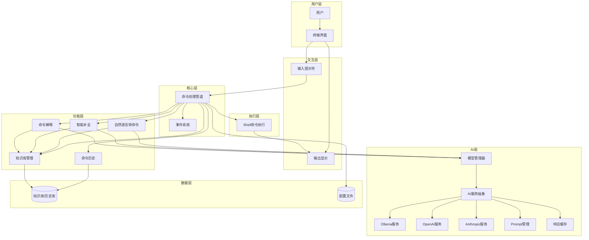
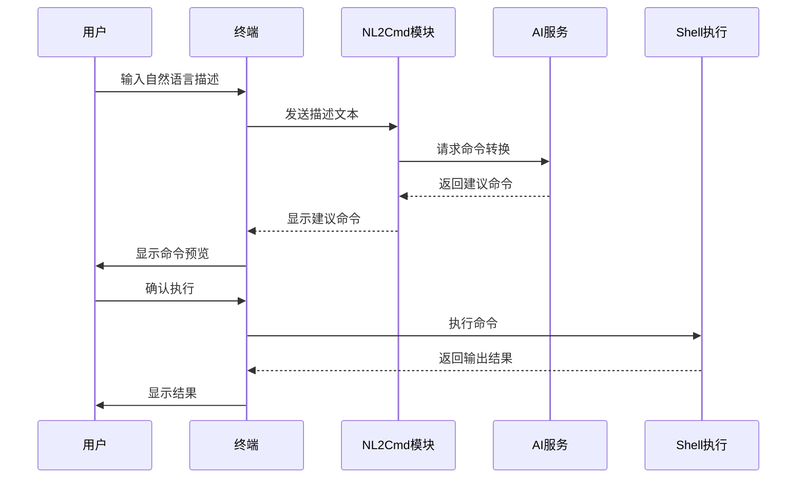
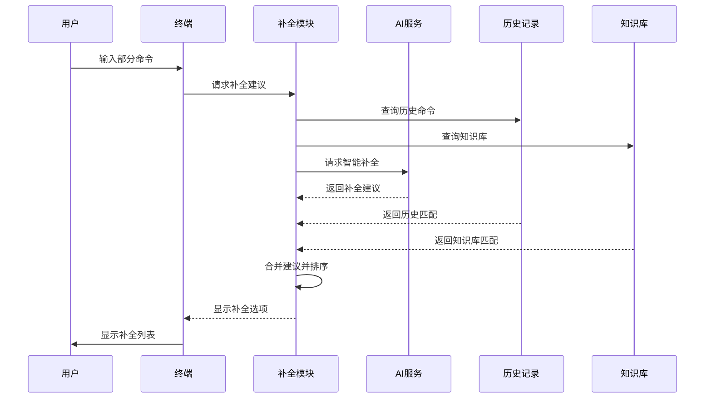
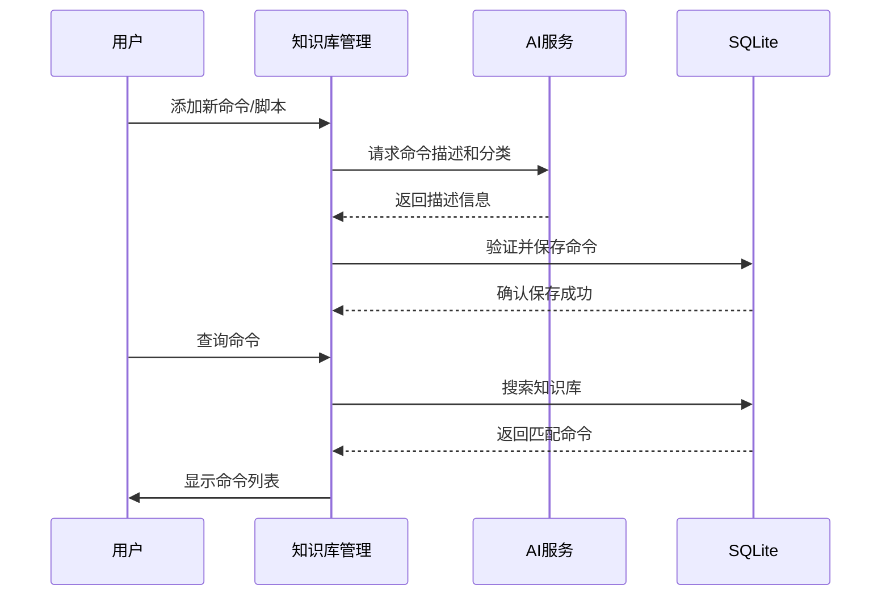
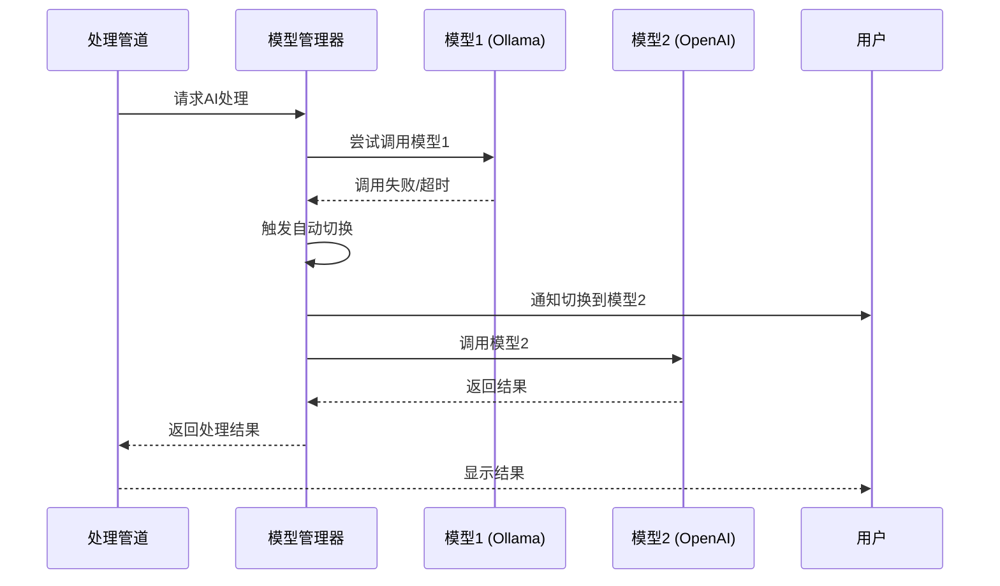

# 架构设计

## 系统概述

smart_term 是一个基于Python的智能终端增强工具，采用模块化架构设计。系统通过插件化的方式组织各个功能模块，支持本地和云端AI模型，为用户提供自然语言命令转换、智能补全、命令解释等智能终端体验。系统采用事件驱动的交互模式，通过统一的命令处理管道完成用户输入的解析、转换和执行。

## 技术栈

**语言与运行时**
- Python 3.10+
- 标准库模块

**框架与库**
- prompt_toolkit - 终端交互和UI组件
- rich - 终端富文本输出和格式化
- click / argparse - 命令行参数解析
- openai / langchain - AI模型集成
- ollama - Ollama本地模型集成
- httpx / aiohttp - HTTP客户端

**数据存储**
- SQLite - 命令历史、知识库存储
- JSON/TOML - 配置文件管理
- 缓存层 - AI响应缓存（有效期10分钟）

**基础设施**
- 无需服务器端
- 本地桌面应用
- 可选容器化部署

**外部服务**
- Ollama (本地模型服务)
- OpenAI API (可选)
- Anthropic API (可选)
- 其他云端模型API (可选)

## 项目结构（建议）

```
smart_term/
├── src/
│   ├── __init__.py
│   ├── main.py              # 应用入口
│   ├── core/                # 核心功能模块
│   │   ├── __init__.py
│   │   ├── terminal.py      # 终端交互核心
│   │   ├── pipeline.py      # 命令处理管道
│   │   └── events.py        # 事件系统
 │   ├── ai/                  # AI服务模块
│   │   ├── __init__.py
│   │   ├── base.py          # AI服务抽象接口
│   │   ├── ollama.py        # Ollama本地模型集成
│   │   ├── openai.py        # OpenAI集成
│   │   ├── anthropic.py     # Anthropic集成
│   │   ├── manager.py       # 多模型管理器
│   │   └── prompt.py        # Prompt管理
│   ├── features/            # 功能模块
│   │   ├── __init__.py
│   │   ├── nl2cmd.py        # 自然语言转命令
│   │   ├── completion.py    # 智能补全
│   │   ├── explanation.py   # 命令解释
│   │   ├── history.py       # 命令历史
│   │   └── kb.py            # 知识库管理
│   ├── models/              # 数据模型
│   │   ├── __init__.py
│   │   ├── command.py       # 命令数据结构
│   │   ├── history.py       # 历史记录
│   │   ├── kb.py            # 知识库模型
│   │   └── config.py        # 配置模型
│   ├── ui/                  # 用户界面
│   │   ├── __init__.py
│   │   ├── prompt.py        # 提示符和输入处理
│   │   ├── display.py       # 输出展示
│   │   └── theme.py         # 主题管理
│   ├── utils/               # 工具函数
│   │   ├── __init__.py
│   │   ├── shell.py         # Shell命令执行
│   │   └── validator.py     # 命令验证
│   └── config/              # 配置管理
│       ├── __init__.py
│       ├── settings.py      # 配置加载
│       └── default.py       # 默认配置
├── tests/                   # 测试套件
│   ├── unit/                # 单元测试
│   ├── integration/         # 集成测试
│   └── fixtures/            # 测试数据
├── data/                    # 数据目录
│   ├── history.db           # 命令历史数据库
│   └── prompts/             # Prompt模板
├── config/                  # 配置文件
│   └── default.toml         # 默认配置
├── pyproject.toml           # 项目配置
├── requirements.txt         # 依赖列表
└── README.md                # 项目说明
```

## 核心模块/组件

### 终端交互核心 (core/terminal)
**目的**: 管理终端UI、用户输入和输出显示
**位置**: `src/core/terminal.py`
**关键文件**: `src/ui/prompt.py`, `src/ui/display.py`
**依赖**: prompt_toolkit, rich
**被依赖**: 所有功能模块

### 命令处理管道 (core/pipeline)
**目的**: 协调各个功能模块处理用户输入
**位置**: `src/core/pipeline.py`
**关键文件**: `src/core/pipeline.py`
**依赖**: 所有features模块
**被依赖**: terminal

### AI服务层 (ai/)
**目的**: 统一抽象AI服务，支持多种模型
**位置**: `src/ai/base.py`
**关键文件**: `src/ai/base.py`, `src/ai/ollama.py`, `src/ai/openai.py`, `src/ai/manager.py`
**依赖**: ollama, openai, httpx
**被依赖**: nl2cmd, completion, explanation

### 模型管理器 (ai/manager)
**目的**: 管理多个AI模型配置，实现自动切换和回退
**位置**: `src/ai/manager.py`
**关键文件**: `src/ai/manager.py`
**依赖**: 所有AI服务实现
**被依赖**: pipeline

### 知识库管理 (features/kb)
**目的**: 维护命令知识库，支持系统命令和自定义脚本
**位置**: `src/features/kb.py`
**关键文件**: `src/models/kb.py`, `src/features/kb.py`
**依赖**: SQLite
**被依赖**: nl2cmd, completion, explanation

### 自然语言转命令 (features/nl2cmd)
**目的**: 将自然语言转换为Shell命令，基于知识库筛选
**位置**: `src/features/nl2cmd.py`
**关键文件**: `src/features/nl2cmd.py`
**依赖**: ai服务层, 知识库
**被依赖**: pipeline

### 智能补全 (features/completion)
**目的**: 提供上下文感知的命令补全
**位置**: `src/features/completion.py`
**关键文件**: `src/features/completion.py`
**依赖**: ai服务层, shell工具
**被依赖**: terminal

### 命令解释 (features/explanation)
**目的**: 解释命令的功能和参数
**位置**: `src/features/explanation.py`
**关键文件**: `src/features/explanation.py`
**依赖**: ai服务层
**被依赖**: pipeline

### 命令历史 (features/history)
**目的**: 管理和查询命令历史
**位置**: `src/features/history.py`
**关键文件**: `src/models/history.py`, `src/features/history.py`
**依赖**: SQLite
**被依赖**: pipeline, completion

## 架构图



## 关键流程

### 自然语言命令转换流程



### 智能补全流程



### 知识库管理流程



### 模型切换与回退流程



## 设计决策

### 为什么选择Python?
- 丰富的AI生态，易于集成各种AI服务
- prompt_toolkit和rich提供强大的终端UI能力
- 跨平台支持，易于部署
- 社区活跃，易于获取帮助

### 为什么支持多种AI服务?
- 本地Ollama模型保护隐私，适合敏感环境
- 云端模型提供更强的自然语言理解能力
- 模型切换与回退机制确保服务可用性
- 用户可以根据需求灵活选择

### 为什么引入知识库管理?
- 提供结构化的命令存储，支持系统命令和自定义脚本
- 提高命令筛选的准确性和效率
- 支持用户扩展自定义脚本
- 与AI模型配合，提供更智能的命令推荐

### 为什么使用SQLite存储历史和知识库?
- 轻量级，无需额外服务
- 查询性能好，支持复杂搜索和筛选
- 事务支持，数据安全
- Python标准库支持，无额外依赖

### 为什么采用管道式架构?
- 各功能模块职责清晰，易于维护
- 灵活组合不同功能
- 便于添加新功能模块
- 支持功能开关和插件化

### 为什么分离AI服务抽象并添加模型管理器?
- 统一接口，便于切换不同AI服务
- 模型管理器实现自动切换和回退机制
- 降低各功能模块与AI服务的耦合
- 便于测试和Mock
- 支持未来扩展新的AI服务

### 为什么添加响应缓存?
- 减少重复的AI模型调用，降低成本
- 提高响应速度，改善用户体验
- 支持批量场景下的性能优化
- 10分钟有效期平衡性能和准确性
