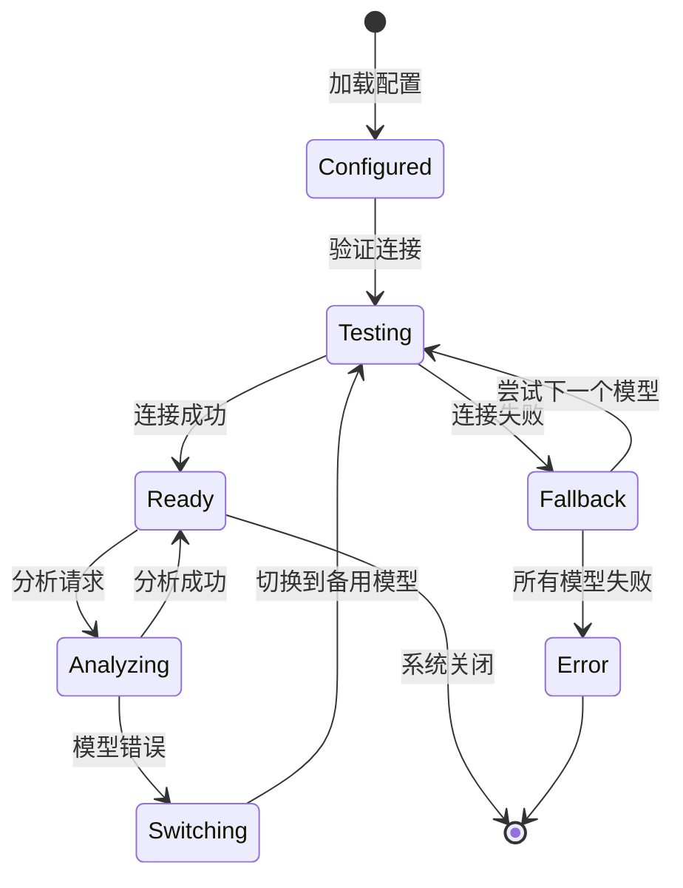
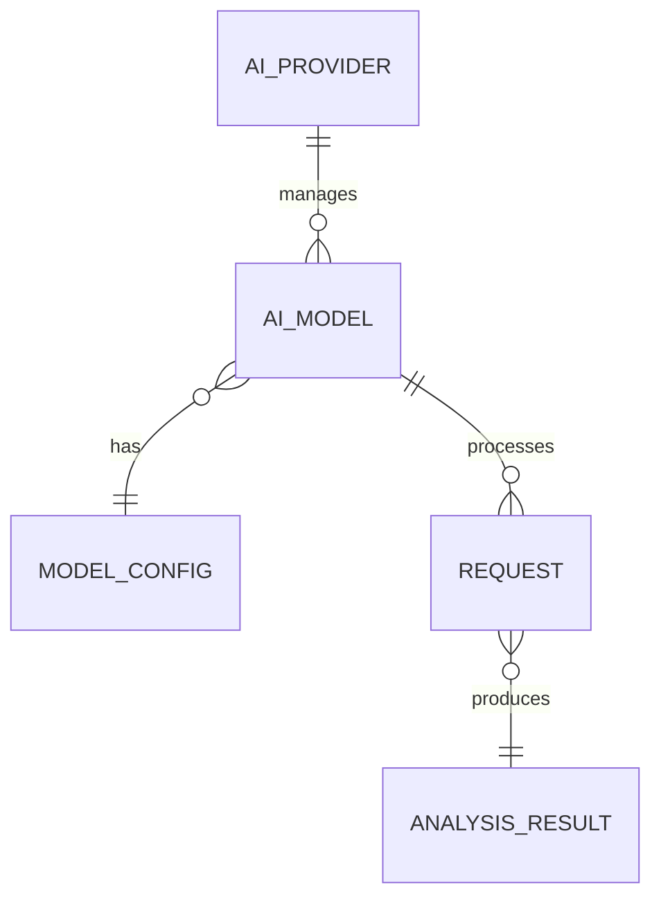

# AI 模型

AI 模型是智能终端系统的核心组件，负责自然语言理解、语义分析和意图识别。系统支持多种 AI 模型提供商，包括本地 Ollama 模型和云端 API 模型（OpenAI、Anthropic 等），并提供了统一的接口和自动切换机制。

## 什么是 AI 模型？

AI 模型是大语言模型（LLM），用于分析用户的自然语言输入，提取关键语义信息，并理解用户的意图。系统通过调用 AI 模型的 API 来实现自然语言理解功能。

**关键特征**:
- 统一接口：所有模型提供商使用相同的接口规范
- 自动切换：当模型不可用时自动切换到备用模型
- 流式响应：支持流式输出以提升用户体验
- 可配置：支持配置温度、最大 token 数等参数

## 代码位置

| 方面 | 位置 |
|------|------|
| 模型基类 | `core/ai/base.py` |
| Ollama 模型 | `core/ai/ollama.py` |
| OpenAI 模型 | `core/ai/openai.py` |
| Anthropic 模型 | `core/ai/anthropic.py` |
| 模型提供商管理 | `core/ai/provider.py` |
| 测试 | `tests/unit/test_ai.py` |

## 结构

### 模型配置

```python
from dataclasses import dataclass
from typing import Optional
from enum import Enum

class ModelProvider(Enum):
    OLLAMA = "ollama"
    OPENAI = "openai"
    ANTHROPIC = "anthropic"

@dataclass
class ModelConfig:
    """模型配置"""
    provider: ModelProvider      # 提供商
    name: str                    # 模型名称
    api_key: Optional[str] = None # API 密钥
    base_url: Optional[str] = None # API 地址
    temperature: float = 0.7     # 温度参数
    max_tokens: int = 500        # 最大 token 数
    timeout: int = 15            # 超时时间（秒）
    priority: int = 0            # 优先级（数值越大优先级越高）
```

### 分析结果

```python
from dataclasses import dataclass
from typing import List, Optional

@dataclass
class AnalysisResult:
    """AI 分析结果"""
    intent: str                  # 识别的意图
    entities: List[str]          # 提取的实体
    confidence: float            # 置信度（0-1）
    suggested_commands: List[str] # 建议的命令
    clarifications: Optional[List[str]] = None # 需要澄清的问题
```

### 模型基类

```python
from abc import ABC, abstractmethod

class BaseAIModel(ABC):
    """AI 模型基类"""

    def __init__(self, config: ModelConfig):
        self.config = config

    @abstractmethod
    async def analyze(self, input: str) -> AnalysisResult:
        """分析自然语言输入"""
        pass

    @abstractmethod
    async def test_connection(self) -> bool:
        """测试模型连接"""
        pass

    @abstractmethod
    async def close(self):
        """关闭连接"""
        pass
```

### 关键字段

| 字段 | 类型 | 描述 | 约束 |
|------|------|------|------|
| `provider` | `ModelProvider` | 模型提供商 | 必须是支持的提供商之一 |
| `name` | `str` | 模型名称 | 不为空 |
| `temperature` | `float` | 温度参数 | 0.0-2.0 |
| `max_tokens` | `int` | 最大 token 数 | 大于 0 |
| `timeout` | `int` | 超时时间 | 大于 0 |

## 不变量

这些规则对有效的 AI 模型配置必须始终成立：

1. **API 密钥有效性**: 云端模型必须提供有效的 API 密钥
   - OpenAI 模型需要 `api_key`
   - Anthropic 模型需要 `api_key`

2. **模型可用性**: 模型必须可以正常连接和响应
   - 启动时验证连接
   - 调用时处理超时和错误

3. **配置一致性**: 模型配置必须与提供商要求一致
   - Ollama 模型需要 `base_url`
   - 云端模型需要 `api_key`

## 生命周期



### 状态描述

| 状态 | 描述 | 允许的转换 |
|------|------|-----------|
| `Configured` | 模型已配置 | → Testing |
| `Testing` | 正在测试连接 | → Ready, Fallback |
| `Ready` | 模型可用 | → Analyzing |
| `Analyzing` | 正在分析请求 | → Ready, Switching |
| `Fallback` | 回退到备用模型 | → Testing |
| `Error` | 所有模型不可用 | → [*] |
| `Switching` | 正在切换模型 | → Testing |

## 关系



| 关联概念 | 关系 | 描述 |
|---------|------|------|
| [ModelConfig] | 包含 | 一个 AI 模型有一个配置 |
| [AnalysisResult] | 产生 | 一个请求产生一个分析结果 |
| [AIProvider] | 管理 | 一个提供商管理多个模型 |

## 使用示例

### 使用 Ollama 模型

```python
from learn_nanobot.core.ai.ollama import OllamaModel
from learn_nanobot.core.ai.base import ModelConfig, ModelProvider

# 配置 Ollama 模型
config = ModelConfig(
    provider=ModelProvider.OLLAMA,
    name="llama3",
    base_url="http://localhost:11434",
    temperature=0.7,
    max_tokens=500,
    timeout=30
)

# 创建模型实例
model = OllamaModel(config)

# 测试连接
if await model.test_connection():
    print("Ollama 模型连接成功")

    # 分析输入
    result = await model.analyze("列出当前目录的所有文件")
    print(f"意图: {result.intent}")
    print(f"置信度: {result.confidence}")
    print(f"建议命令: {result.suggested_commands}")

# 关闭连接
await model.close()
```

### 使用 OpenAI 模型

```python
from learn_nanobot.core.ai.openai import OpenAIModel
from learn_nanobot.core.ai.base import ModelConfig, ModelProvider
import os

# 配置 OpenAI 模型
config = ModelConfig(
    provider=ModelProvider.OPENAI,
    name="gpt-3.5-turbo",
    api_key=os.getenv("OPENAI_API_KEY"),
    base_url="https://api.openai.com/v1",
    temperature=0.7,
    max_tokens=500,
    timeout=15
)

# 创建模型实例
model = OpenAIModel(config)

# 测试连接
if await model.test_connection():
    print("OpenAI 模型连接成功")

    # 分析输入
    result = await model.analyze("查找包含 error 的日志文件")
    print(f"意图: {result.intent}")
    print(f"实体: {result.entities}")

# 关闭连接
await model.close()
```

### 使用模型提供商管理

```python
from learn_nanobot.core.ai.provider import AIModelProvider

# 创建模型提供商管理器
provider = AIModelProvider()

# 加载配置
await provider.load_config("config.yaml")

# 获取默认模型
default_model = provider.get_default_model()

# 分析输入
result = await default_model.analyze("列出当前目录的所有文件")

# 切换模型
await provider.switch_model("ollama:llama3")

# 列出所有可用模型
models = provider.list_models()
for model in models:
    print(f"{model.config.name} (状态: {'可用' if model.is_available else '不可用'})")

# 自动切换（启用回退）
provider.enable_auto_fallback(True)
```

### 流式响应

```python
from learn_nanobot.core.ai.openai import OpenAIModel

model = OpenAIModel(config)

# 流式分析
async for chunk in model.analyze_stream("列出当前目录的所有文件"):
    print(chunk, end="", flush=True)

print()
```

## 错误处理

```python
from learn_nanobot.core.ai.exceptions import (
    ModelNotAvailableError,
    ModelTimeoutError,
    ModelConnectionError
)

try:
    result = await model.analyze(input_text)
except ModelNotAvailableError as e:
    logger.error(f"模型不可用: {e}")
    # 尝试切换到备用模型
except ModelTimeoutError as e:
    logger.error(f"模型超时: {e}")
    # 增加超时时间并重试
except ModelConnectionError as e:
    logger.error(f"连接错误: {e}")
    # 检查网络连接
```

## 性能优化

### 请求缓存

```python
from functools import lru_cache

class BaseAIModel(ABC):
    def __init__(self, config: ModelConfig):
        self.config = config
        self._cache = {}

    async def analyze(self, input: str) -> AnalysisResult:
        # 检查缓存
        cache_key = hash(input)
        if cache_key in self._cache:
            return self._cache[cache_key]

        # 调用模型
        result = await self._analyze(input)

        # 缓存结果
        self._cache[cache_key] = result
        return result
```

### 批量请求

```python
async def batch_analyze(self, inputs: List[str]) -> List[AnalysisResult]:
    """批量分析输入"""
    tasks = [self.analyze(input) for input in inputs]
    results = await asyncio.gather(*tasks, return_exceptions=True)
    return results
```

### 连接池

```python
class OpenAIModel(BaseAIModel):
    def __init__(self, config: ModelConfig):
        super().__init__(config)
        self._session = None

    async def _get_session(self):
        """获取或创建 HTTP 会话"""
        if self._session is None:
            self._session = aiohttp.ClientSession(
                timeout=aiohttp.ClientTimeout(total=self.config.timeout)
            )
        return self._session
```

## 扩展指南

### 添加新的模型提供商

1. 创建新模型类，继承 `BaseAIModel`
2. 实现 `analyze()` 和 `test_connection()` 方法
3. 在 `ModelProvider` 枚举中添加新提供商
4. 在 `AIModelProvider` 中注册新模型
5. 编写单元测试
6. 更新文档

**示例**:

```python
from learn_nanobot.core.ai.base import BaseAIModel, ModelConfig

class CustomAIModel(BaseAIModel):
    """自定义 AI 模型"""

    async def analyze(self, input: str) -> AnalysisResult:
        # 实现分析逻辑
        pass

    async def test_connection(self) -> bool:
        # 实现连接测试
        pass
```

### 自定义提示词模板

```python
PROMPT_TEMPLATE = """
你是一个命令行助手。根据用户的自然语言输入，提取关键信息。

用户输入: {input}

请返回 JSON 格式的结果：
{{
    "intent": "用户意图",
    "entities": ["实体1", "实体2"],
    "confidence": 0.95,
    "suggested_commands": ["命令1", "命令2"]
}}
"""

class CustomModel(BaseAIModel):
    async def analyze(self, input: str) -> AnalysisResult:
        prompt = PROMPT_TEMPLATE.format(input=input)
        response = await self._call_api(prompt)
        return self._parse_response(response)
```
