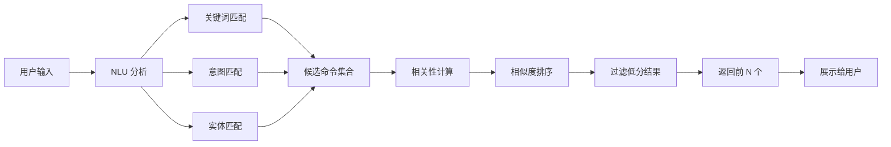

# 命令推荐

命令推荐是智能终端系统的核心功能，负责根据用户的自然语言输入和 AI 分析结果，从知识库中筛选出最合适的命令并推荐给用户。推荐算法结合了关键词匹配、语义搜索和 AI 模型评分，确保推荐的命令与用户需求高度相关。

## 什么是命令推荐？

命令推荐是一个多阶段的过滤和排序过程，包括候选命令筛选、相关性计算和结果排序。它利用 AI 模型的语义理解能力和知识库的结构化数据，为用户提供个性化的命令推荐。

**关键特征**:
- 多阶段过滤：关键词匹配 → 语义搜索 → 相关性评分
- AI 驱动：使用 AI 模型计算语义相似度
- 可配置：支持调整推荐数量、最小相似度阈值等参数
- 实时响应：快速响应用户输入

## 代码位置

| 方面 | 位置 |
|------|------|
| 命令选择器 | `core/recommender/selector.py` |
| 相关性排序器 | `core/recommender/ranker.py` |
| 推荐引擎 | `core/recommender/engine.py` |
| 测试 | `tests/unit/test_recommender.py` |

## 结构

### 推荐结果

```python
from dataclasses import dataclass
from typing import List
from learn_nanobot.core.kb.command import Command

@dataclass
class Recommendation:
    """推荐结果"""
    command: Command            # 命令对象
    similarity: float          # 相似度分数（0-1）
    match_reason: str          # 匹配原因
    suggested_params: dict      # 建议的参数值
```

### 推荐配置

```python
from dataclasses import dataclass

@dataclass
class RecommendationConfig:
    """推荐配置"""
    max_results: int = 3              # 最大推荐数量
    min_similarity: float = 0.5      # 最小相似度阈值
    use_semantic_search: bool = True # 是否使用语义搜索
    enable_ai_ranking: bool = True   # 是否启用 AI 排序
    cache_results: bool = True        # 是否缓存结果
```

### 推荐引擎

```python
from typing import List
from learn_nanobot.core.ai.base import AnalysisResult
from learn_nanobot.core.kb.command import Command

class RecommendationEngine:
    """推荐引擎"""

    def __init__(self, config: RecommendationConfig):
        self.config = config
        self.selector = CommandSelector()
        self.ranker = CommandRanker()

    async def recommend(
        self,
        user_input: str,
        ai_result: AnalysisResult,
        knowledge_base: List[Command]
    ) -> List[Recommendation]:
        """根据用户输入和 AI 分析结果推荐命令"""
        # 1. 筛选候选命令
        candidates = await self.selector.select(
            user_input,
            ai_result,
            knowledge_base
        )

        # 2. 排序候选命令
        ranked = await self.ranker.rank(
            user_input,
            ai_result,
            candidates
        )

        # 3. 返回前 N 个结果
        return ranked[:self.config.max_results]
```

### 命令选择器

```python
class CommandSelector:
    """命令选择器"""

    async def select(
        self,
        user_input: str,
        ai_result: AnalysisResult,
        knowledge_base: List[Command]
    ) -> List[Command]:
        """筛选候选命令"""
        candidates = []

        # 1. 关键词匹配
        keyword_matches = self._match_keywords(
            user_input,
            knowledge_base
        )
        candidates.extend(keyword_matches)

        # 2. 意图匹配
        intent_matches = self._match_intent(
            ai_result.intent,
            knowledge_base
        )
        candidates.extend(intent_matches)

        # 3. 实体匹配
        for entity in ai_result.entities:
            entity_matches = self._match_entity(
                entity,
                knowledge_base
            )
            candidates.extend(entity_matches)

        # 4. 去重
        return self._deduplicate(candidates)
```

### 相关性排序器

```python
class CommandRanker:
    """相关性排序器"""

    async def rank(
        self,
        user_input: str,
        ai_result: AnalysisResult,
        candidates: List[Command]
    ) -> List[Recommendation]:
        """对候选命令排序"""
        recommendations = []

        for command in candidates:
            # 计算相似度
            similarity = await self._calculate_similarity(
                user_input,
                ai_result,
                command
            )

            # 如果相似度达到阈值，添加到结果
            if similarity >= self.config.min_similarity:
                recommendation = Recommendation(
                    command=command,
                    similarity=similarity,
                    match_reason=self._get_match_reason(
                        user_input,
                        command
                    ),
                    suggested_params=self._suggest_params(
                        user_input,
                        ai_result,
                        command
                    )
                )
                recommendations.append(recommendation)

        # 按相似度降序排序
        return sorted(
            recommendations,
            key=lambda r: r.similarity,
            reverse=True
        )

    async def _calculate_similarity(
        self,
        user_input: str,
        ai_result: AnalysisResult,
        command: Command
    ) -> float:
        """计算相似度分数"""
        scores = []

        # 1. 关键词匹配分数
        keyword_score = self._keyword_score(user_input, command)
        scores.append(keyword_score * 0.3)

        # 2. 意图匹配分数
        intent_score = self._intent_score(ai_result, command)
        scores.append(intent_score * 0.3)

        # 3. 语义相似度（AI 模型）
        if self.config.use_semantic_search:
            semantic_score = await self._semantic_score(
                user_input,
                command
            )
            scores.append(semantic_score * 0.4)

        # 综合分数
        return sum(scores)
```

### 关键字段

| 字段 | 类型 | 描述 | 约束 |
|------|------|------|------|
| `max_results` | `int` | 最大推荐数量 | 1-10 |
| `min_similarity` | `float` | 最小相似度阈值 | 0.0-1.0 |
| `similarity` | `float` | 相似度分数 | 0.0-1.0 |

## 不变量

这些规则对有效的推荐结果必须始终成立：

1. **数量限制**: 推荐结果数量不超过 `max_results`
   - 返回前 N 个最匹配的命令

2. **相似度阈值**: 所有推荐的命令相似度不低于 `min_similarity`
   - 过滤掉低相关性的命令

3. **去重性**: 推荐结果中不包含重复的命令
   - 同一命令只出现一次

4. **排序性**: 推荐结果按相似度降序排序
   - 相似度最高的命令排在最前面

## 推荐流程



### 详细流程

1. **接收输入**: 用户输入自然语言需求
2. **NLU 分析**: AI 模型分析输入，提取意图和实体
3. **关键词匹配**: 基于关键词从知识库筛选命令
4. **意图匹配**: 基于意图筛选命令
5. **实体匹配**: 基于实体筛选命令
6. **合并去重**: 合并所有匹配结果并去重
7. **相关性计算**: 计算每个候选命令的相似度分数
8. **相似度排序**: 按相似度降序排序
9. **过滤低分**: 过滤掉相似度低于阈值的命令
10. **返回结果**: 返回前 N 个最匹配的命令

## 使用示例

### 基本推荐

```python
from learn_nanobot.core.recommender.engine import RecommendationEngine
from learn_nanobot.core.recommender.base import RecommendationConfig

# 创建推荐引擎
config = RecommendationConfig(
    max_results=3,
    min_similarity=0.5
)
engine = RecommendationEngine(config)

# 推荐命令
user_input = "列出当前目录的所有文件"
ai_result = await nlu.analyze(user_input)
knowledge_base = await kb_manager.get_all_commands()

recommendations = await engine.recommend(
    user_input=user_input,
    ai_result=ai_result,
    knowledge_base=knowledge_base
)

# 展示结果
for i, rec in enumerate(recommendations, 1):
    print(f"[{i}] {rec.command.name}")
    print(f"    相似度: {rec.similarity:.2%}")
    print(f"    描述: {rec.command.description}")
    print()
```

### 自定义推荐策略

```python
# 自定义选择器
class CustomSelector(CommandSelector):
    async def select(self, user_input, ai_result, knowledge_base):
        # 自定义筛选逻辑
        candidates = []

        # 优先推荐系统命令
        system_cmds = [cmd for cmd in knowledge_base if cmd.type == CommandType.SYSTEM]
        candidates.extend(system_cmds)

        # 然后推荐自定义脚本
        custom_scripts = [cmd for cmd in knowledge_base if cmd.type == CommandType.CUSTOM]
        candidates.extend(custom_scripts)

        return candidates

# 使用自定义选择器
engine.selector = CustomSelector()
```

### 自定义排序算法

```python
# 自定义排序器
class CustomRanker(CommandRanker):
    async def _calculate_similarity(self, user_input, ai_result, command):
        # 自定义相似度计算
        scores = []

        # 关键词匹配
        keyword_score = self._keyword_score(user_input, command)
        scores.append(keyword_score * 0.5)

        # 标签匹配
        tag_score = self._tag_score(ai_result, command)
        scores.append(tag_score * 0.3)

        # 使用频率（历史记录）
        usage_score = await self._usage_score(command)
        scores.append(usage_score * 0.2)

        return sum(scores)

# 使用自定义排序器
engine.ranker = CustomRanker()
```

### 缓存推荐结果

```python
from functools import lru_cache

class RecommendationEngine:
    def __init__(self, config):
        self.config = config
        if config.cache_results:
            self._recommend_cached = lru_cache(maxsize=128)(self._recommend_impl)

    async def recommend(self, user_input, ai_result, knowledge_base):
        if self.config.cache_results:
            # 使用缓存
            cache_key = (user_input, frozenset(kb.id for kb in knowledge_base))
            return await self._recommend_cached(cache_key, user_input, ai_result, knowledge_base)
        else:
            return await self._recommend_impl(user_input, ai_result, knowledge_base)

    async def _recommend_impl(self, user_input, ai_result, knowledge_base):
        # 实际推荐逻辑
        pass
```

## 性能优化

### 并行计算

```python
async def rank(self, user_input, ai_result, candidates):
    """并行计算相似度"""
    tasks = [
        self._calculate_similarity(user_input, ai_result, cmd)
        for cmd in candidates
    ]
    similarities = await asyncio.gather(*tasks)

    recommendations = []
    for cmd, sim in zip(candidates, similarities):
        if sim >= self.config.min_similarity:
            recommendations.append(Recommendation(
                command=cmd,
                similarity=sim,
                match_reason="",
                suggested_params={}
            ))

    return sorted(recommendations, key=lambda r: r.similarity, reverse=True)
```

### 索引优化

```python
from collections import defaultdict

class CommandSelector:
    def __init__(self):
        self._keyword_index = defaultdict(set)
        self._intent_index = defaultdict(set)

    def build_index(self, knowledge_base):
        """构建索引"""
        for cmd in knowledge_base:
            # 关键词索引
            for keyword in cmd.keywords:
                self._keyword_index[keyword].add(cmd.id)

            # 意图索引（如果命令有意图标签）
            if hasattr(cmd, 'intent_tags'):
                for intent in cmd.intent_tags:
                    self._intent_index[intent].add(cmd.id)

    def _match_keywords(self, user_input, knowledge_base):
        """使用索引快速匹配"""
        matched_ids = set()
        for keyword in self._extract_keywords(user_input):
            matched_ids.update(self._keyword_index.get(keyword, set()))

        return [cmd for cmd in knowledge_base if cmd.id in matched_ids]
```

## 扩展指南

### 添加新的匹配策略

```python
class AdvancedSelector(CommandSelector):
    """高级命令选择器"""

    async def select(self, user_input, ai_result, knowledge_base):
        candidates = []

        # 1. 关键词匹配
        candidates.extend(self._match_keywords(user_input, knowledge_base))

        # 2. 意图匹配
        candidates.extend(self._match_intent(ai_result.intent, knowledge_base))

        # 3. 实体匹配
        for entity in ai_result.entities:
            candidates.extend(self._match_entity(entity, knowledge_base))

        # 4. 上下文感知匹配（新增）
        if self._has_context(user_input):
            context_matches = await self._match_context(user_input, knowledge_base)
            candidates.extend(context_matches)

        # 5. 学习历史偏好（新增）
        if self._has_learning_enabled():
            pref_matches = await self._match_preferences(user_input, knowledge_base)
            candidates.extend(pref_matches)

        return self._deduplicate(candidates)
```

### 添加新的相似度因子

```python
class EnhancedRanker(CommandRanker):
    """增强的排序器"""

    async def _calculate_similarity(self, user_input, ai_result, command):
        scores = {}

        # 1. 关键词匹配分数
        scores['keyword'] = self._keyword_score(user_input, command) * 0.3

        # 2. 意图匹配分数
        scores['intent'] = self._intent_score(ai_result, command) * 0.3

        # 3. 语义相似度
        scores['semantic'] = await self._semantic_score(user_input, command) * 0.2

        # 4. 历史使用频率（新增）
        scores['usage'] = await self._usage_score(command) * 0.1

        # 5. 用户偏好（新增）
        scores['preference'] = await self._preference_score(command) * 0.1

        return sum(scores.values())
```
