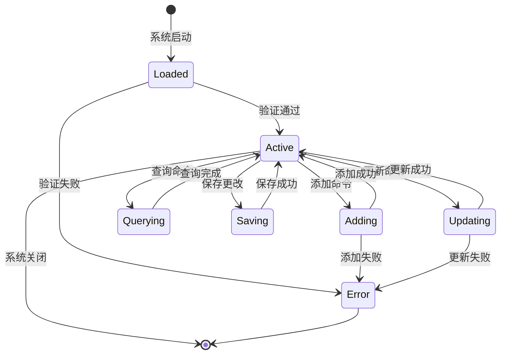
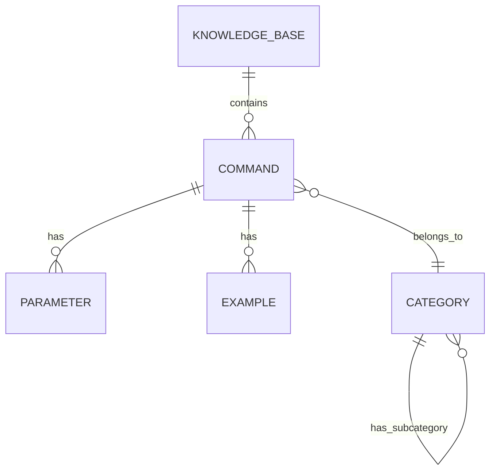

# 知识库

知识库是智能终端系统的核心组件，用于存储和管理系统命令、自定义脚本及其相关信息。它为 AI 模型和推荐系统提供数据支持，是自然语言理解和命令推荐的基础。

## 什么是知识库？

知识库是一个结构化的命令数据库，包含命令的功能描述、参数说明、使用示例、关键词等信息。它使系统能够根据用户的自然语言输入快速找到并推荐合适的命令。

**关键特征**:
- 结构化存储：使用 JSON 格式存储命令数据
- 语义丰富：每个命令包含描述、关键词、示例等多维度信息
- 类型分类：区分系统命令和自定义脚本
- 易于扩展：支持动态添加和更新命令

## 代码位置

| 方面 | 位置 |
|------|------|
| 数据模型 | `core/kb/command.py` |
| 知识库管理器 | `core/kb/manager.py` |
| 知识库加载器 | `core/kb/loader.py` |
| 数据文件 | `data/knowledge.json` |
| 测试 | `tests/unit/test_kb.py` |

## 结构

### 命令数据结构

```python
from dataclasses import dataclass
from typing import List, Optional
from datetime import datetime
from enum import Enum

class CommandType(Enum):
    SYSTEM = "system"      # 系统命令
    CUSTOM = "custom"      # 自定义脚本

@dataclass
class CommandParameter:
    """命令参数定义"""
    name: str
    description: str
    required: bool = False
    default: Optional[str] = None
    choices: Optional[List[str]] = None

@dataclass
class Command:
    """命令数据模型"""
    id: str                          # 唯一标识符
    name: str                        # 命令名称
    type: CommandType               # 命令类型
    description: str                 # 功能描述
    keywords: List[str]             # 匹配关键词
    command_template: str            # 命令模板
    parameters: List[CommandParameter] = None  # 参数列表
    examples: List[str] = None       # 使用示例
    aliases: List[str] = None        # 命令别名
    tags: List[str] = None           # 分类标签
    created_at: datetime = None      # 创建时间
    updated_at: datetime = None      # 更新时间
```

### 知识库结构

```python
@dataclass
class KnowledgeBase:
    """知识库数据模型"""
    commands: List[Command]           # 命令列表
    categories: List[Category] = None # 分类列表
    version: str = "1.0"             # 知识库版本
```

### 关键字段

| 字段 | 类型 | 描述 | 约束 |
|------|------|------|------|
| `id` | `str` | 命令唯一标识符 | 必须唯一，格式：`cmd-<id>` |
| `name` | `str` | 命令名称 | 不为空 |
| `type` | `CommandType` | 命令类型 | system 或 custom |
| `keywords` | `List[str]` | 匹配关键词 | 至少包含 1 个关键词 |
| `command_template` | `str` | 命令模板 | 必须包含 `{param}` 占位符 |
| `examples` | `List[str]` | 使用示例 | 可选，建议至少 1 个 |

## 不变量

这些规则对有效的知识库数据必须始终成立：

1. **ID 唯一性**: 知识库中每个命令的 ID 必须唯一
   - 添加新命令时必须检查 ID 是否已存在

2. **关键词非空**: 每个命令至少包含一个关键词
   - 系统命令必须有相关关键词用于匹配
   - 自定义脚本建议提供中文和英文关键词

3. **命令模板有效性**: 命令模板中的参数必须在参数列表中定义
   - 示例：模板 `ls {options}` 必须定义 `options` 参数

4. **类型一致性**: 系统命令和自定义脚本不得混用相同 ID
   - system 类型和 custom 类型的命令应有不同的 ID 前缀

## 生命周期



### 状态描述

| 状态 | 描述 | 允许的转换 |
|------|------|-----------|
| `Loaded` | 知识库已从文件加载 | → Active, Error |
| `Active` | 知识库正常可用 | → Adding, Updating, Querying, Saving |
| `Error` | 知识库加载或验证失败 | → [*] |

## 关系



| 关联概念 | 关系 | 描述 |
|---------|------|------|
| [CommandParameter] | 包含 | 一个命令可有多个参数 |
| [Example] | 包含 | 一个命令可有多个使用示例 |
| [Category] | 属于 | 一个命令属于一个分类 |
| [Category] | 包含 | 一个分类可有多个子分类 |

## 使用示例

### 查询命令

```python
from learn_nanobot.core.kb.manager import KnowledgeBaseManager

# 初始化知识库管理器
kb_manager = KnowledgeBaseManager()
await kb_manager.load("data/knowledge.json")

# 按关键词查询
commands = await kb_manager.search_by_keywords(["list", "文件"])
for cmd in commands:
    print(f"{cmd.name}: {cmd.description}")

# 按 ID 查询
command = await kb_manager.get_by_id("cmd-001")
if command:
    print(f"找到命令: {command.name}")

# 按类型查询
system_commands = await kb_manager.get_by_type(CommandType.SYSTEM)
custom_scripts = await kb_manager.get_by_type(CommandType.CUSTOM)
```

### 添加命令

```python
from learn_nanobot.core.kb.command import Command, CommandType

# 创建新命令
new_command = Command(
    id="cmd-100",
    name="docker",
    type=CommandType.SYSTEM,
    description="Docker 容器管理工具",
    keywords=["docker", "容器", "container"],
    command_template="docker {action} {options}",
    parameters=[
        CommandParameter(
            name="action",
            description="操作类型",
            required=True,
            choices=["run", "build", "ps", "stop"]
        ),
        CommandParameter(
            name="options",
            description="选项参数",
            required=False
        )
    ],
    examples=[
        "docker run -it ubuntu bash",
        "docker ps -a"
    ],
    tags=["devops", "container"]
)

# 添加到知识库
await kb_manager.add_command(new_command)
await kb_manager.save()
```

### 更新命令

```python
# 获取现有命令
command = await kb_manager.get_by_id("cmd-001")

# 更新字段
command.description = "新的描述"
command.keywords.append("new_keyword")
command.updated_at = datetime.now()

# 保存更改
await kb_manager.update_command(command)
await kb_manager.save()
```

### 删除命令

```python
# 按 ID 删除
await kb_manager.delete_command("cmd-001")
await kb_manager.save()
```

### 验证命令

```python
from learn_nanobot.core.kb.validator import CommandValidator

validator = CommandValidator()

# 验证命令
is_valid, errors = validator.validate(command)
if not is_valid:
    print(f"验证失败: {errors}")
else:
    print("验证通过")
```

## 性能考虑

### 缓存策略

```python
from functools import lru_cache

class KnowledgeBaseManager:
    def __init__(self):
        self._cache = {}

    @lru_cache(maxsize=1000)
    async def search_by_keywords(self, keywords: tuple) -> List[Command]:
        """缓存关键词查询结果"""
        # 实现查询逻辑
        pass
```

### 索引优化

```python
from collections import defaultdict

class KnowledgeBaseManager:
    def __init__(self):
        self._keyword_index = defaultdict(set)  # 关键词到命令 ID 的映射

    def _build_index(self):
        """构建关键词索引"""
        for command in self.commands:
            for keyword in command.keywords:
                self._keyword_index[keyword].add(command.id)
```

## 扩展指南

### 添加新的命令类型

1. 在 `CommandType` 枚举中添加新类型
2. 在 `CommandValidator` 中添加验证逻辑
3. 更新知识库 Schema
4. 更新文档

### 自定义命令加载器

```python
from abc import ABC, abstractmethod

class BaseLoader(ABC):
    """命令加载器基类"""

    @abstractmethod
    async def load(self, source: str) -> List[Command]:
        """从指定源加载命令"""
        pass

class JSONLoader(BaseLoader):
    """JSON 文件加载器"""
    async def load(self, source: str) -> List[Command]:
        # 实现 JSON 文件加载
        pass

class Databaseloader(BaseLoader):
    """数据库加载器"""
    async def load(self, source: str) -> List[Command]:
        # 实现数据库加载
        pass
```
