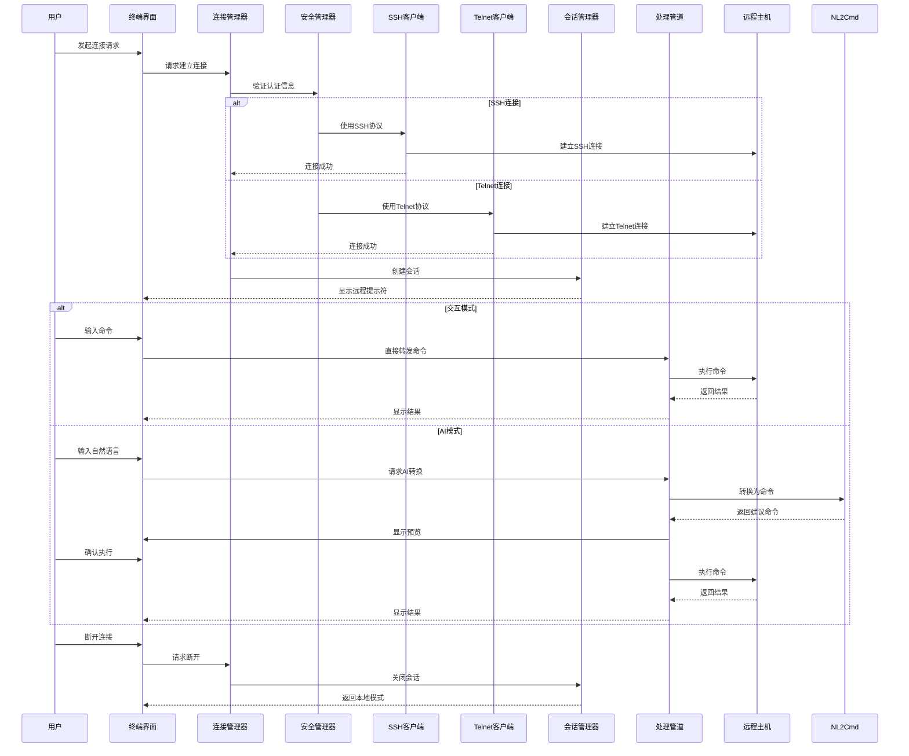
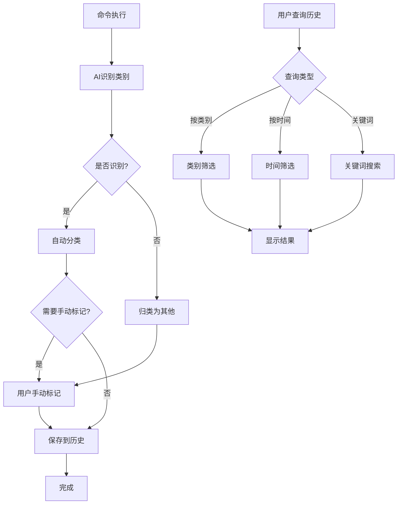

# Terminal Connection Enhancements Design

Feature Name: terminal-connection-enhancements
Updated: 2026-02-03

## Description

本设计文档定义了 smart_term 智能终端工具的两个增强功能：
1. **远程终端连接**：支持 SSH 和 Telnet 协议连接远程主机，提供交互模式和 AI 驱动模式。Telnet 协议通过端口 23 自动推断，SSH 认证方式由用户手动选择（密码或密钥）
2. **设备产品类别化命令历史**：将命令历史按设备产品类型（如网关_海思、网关_中兴微、OLT_zxic、Olt_烽火）组织和管理

这两个功能独立设计但相互协作，远程连接的命令也会被按类别记录到历史中。

## Architecture

### 整体架构图

```mermaid
flowchart TB
    subgraph 用户层
        User[用户]
        Terminal[终端界面]
    end

    subgraph 交互层
        Prompt[输入提示符]
        Display[输出显示]
        ModeSwitch[模式切换]
    end

    subgraph 核心层
        Pipeline[命令处理管道]
        Events[事件系统]
    end

    subgraph 远程连接层（新增）
        ConnManager[连接管理器]
        SSHClient[SSH客户端]
        TelnetClient[Telnet客户端]
        SessionManager[会话管理器]
        SecurityManager[安全管理器]
    end

    subgraph 功能层
        NL2Cmd[自然语言转命令]
        Completion[智能补全]
        Explanation[命令解释]
        History[命令历史]
        KB[知识库管理]
        CatManager[类别管理器（新增）]
    end

    subgraph AI层
        AIManager[模型管理器]
        AIService[AI服务抽象]
        Ollama[Ollama服务]
        OpenAI[OpenAI服务]
        Anthropic[Anthropic服务]
        Prompts[Prompt管理]
        Cache[响应缓存]
    end

    subgraph 数据层
        SQLite[(知识库/历史库)]
        ConfigDB[(连接配置库)]
        Config[(配置文件)]
    end

    subgraph 执行层
        Shell[本地Shell]
        RemoteShell[远程Shell]
    end

    User --> Terminal
    Terminal --> Prompt
    Terminal --> Display
    Terminal --> ModeSwitch

    ModeSwitch --> Pipeline
    Prompt --> Pipeline
    Pipeline --> Events

    Pipeline --> ConnManager
    ConnManager --> SSHClient
    ConnManager --> TelnetClient
    ConnManager --> SessionManager
    ConnManager --> SecurityManager

    Pipeline --> NL2Cmd
    Pipeline --> Completion
    Pipeline --> Explanation
    Pipeline --> History
    Pipeline --> KB

    History --> CatManager

    NL2Cmd --> AIManager
    Completion --> AIManager
    Explanation --> AIManager

    AIManager --> AIService
    AIService --> Ollama
    AIService --> OpenAI
    AIService --> Anthropic
    AIService --> Prompts
    AIService --> Cache

    NL2Cmd --> KB
    Completion --> KB
    Explanation --> KB

    History --> SQLite
    KB --> SQLite
    CatManager --> SQLite
    ConnManager --> ConfigDB
    SessionManager --> ConfigDB
    Pipeline --> Config

    Pipeline --> Shell
    Pipeline --> RemoteShell
    RemoteShell --> ConnManager
    Shell --> Display
    RemoteShell --> Display
```

### 远程连接流程图



### 命令类别管理流程图



## Components and Interfaces

### 新增核心组件

#### ConnectionManager（连接管理器）

**职责**：
- 管理所有远程连接的生命周期
- 提供连接配置的 CRUD 操作
- 协调 SSH 和 Telnet 客户端
- 处理连接状态和错误

**接口**：

```python
class ConnectionManager:
    """远程连接管理器"""

    async def connect(self, config: RemoteConnectionConfig, auth_choice: Optional[str] = None) -> ConnectionSession:
        """
        建立远程连接

        Args:
            config: 连接配置
            auth_choice: 认证方式选择（SSH时有效："password" 或 "key"，None则让用户选择）

        Returns:
            连接会话对象

        Raises:
            ConnectionError: 连接失败
            AuthError: 认证失败
        """

    async def disconnect(self, session: ConnectionSession) -> None:
        """
        断开远程连接

        Args:
            session: 要断开的会话
        """

    async def list_saved_configs(self) -> List[RemoteConnectionConfig]:
        """
        列出所有已保存的连接配置

        Returns:
            连接配置列表
        """

    async def save_config(self, config: RemoteConnectionConfig) -> None:
        """
        保存连接配置

        Args:
            config: 要保存的配置

        Raises:
            ValidationError: 配置验证失败
        """

    async def delete_config(self, config_id: int) -> None:
        """
        删除连接配置

        Args:
            config_id: 配置ID

        Raises:
            NotFoundError: 配置不存在
        """

    async def get_active_session(self) -> Optional[ConnectionSession]:
        """
        获取当前活动的连接会话

        Returns:
            活动会话，如果没有则返回None
        """

    async def switch_to_interactive_mode(self) -> None:
        """
        切换到交互模式（直接转发命令）
        """

    async def switch_to_ai_mode(self) -> None:
        """
        切换到AI模式（通过AI理解命令）
        """
```

#### CategoryManager（设备产品类别管理器）

**职责**：
- 管理设备产品类别的定义
- 根据连接配置关联设备产品类型并标记命令类别
- 提供类别查询和统计功能
- 支持自定义设备产品类别

**接口**：

```python
class CategoryManager:
    """产品类别管理器"""

    async def get_all_categories(self) -> List[CommandCategory]:
        """
        获取所有类别（树形结构）

        Returns:
            类别树列表
        """

    async def get_category_by_id(self, category_id: int) -> Optional[CommandCategory]:
        """
        根据ID获取类别

        Args:
            category_id: 类别ID

        Returns:
            类别对象，如果不存在则返回None
        """

    async def create_category(self, category: CommandCategory) -> int:
        """
        创建新类别

        Args:
            category: 类别对象

        Returns:
            新创建的类别ID
        """

    async def update_category(self, category_id: int, category: CommandCategory) -> None:
        """
        更新类别

        Args:
            category_id: 类别ID
            category: 更新的类别对象
        """

    async def delete_category(self, category_id: int) -> None:
        """
        删除类别

        Args:
            category_id: 类别ID
        """

    async def classify_command(self, command: str, connection_id: int, context: Dict) -> int:
        """
        根据连接配置自动标记命令的设备产品类别

        Args:
            command: 命令字符串
            connection_id: 连接配置ID
            context: 上下文信息

        Returns:
            设备产品类别ID
        """

    async def get_category_statistics(self, category_id: int) -> CategoryStatistics:
        """
        获取设备产品类别的统计信息

        Args:
            category_id: 类别ID

        Returns:
            统计信息
        """

    async def get_all_statistics(self) -> Dict[int, CategoryStatistics]:
        """
        获取所有设备产品类别的统计信息

        Returns:
            类别ID到统计信息的映射
        """

    async def search_commands(
        self,
        query: str,
        category_id: Optional[int] = None
    ) -> List[CategorizedCommandRecord]:
        """
        搜索命令

        Args:
            query: 搜索关键词
            category_id: 设备产品类别ID（可选，指定则在该类别范围内搜索）

        Returns:
            匹配的命令记录列表
        """

    async def get_connections_by_category(self, category_id: int) -> List[RemoteConnectionConfig]:
        """
        获取属于指定设备产品类别的所有连接配置

        Args:
            category_id: 设备产品类别ID

        Returns:
            连接配置列表
        """

    async def export_commands(
        self,
        category_id: Optional[int] = None,
        format: str = "json"
    ) -> str:
        """
        导出命令历史

        Args:
            category_id: 类别ID（可选，不指定则导出所有）
            format: 导出格式（json、csv）

        Returns:
            导出的数据字符串
        """
```

#### SessionManager（会话管理器）

**职责**：
- 管理远程连接会话的状态
- 记录会话中的命令历史
- 处理会话超时和异常断开

**接口**：

```python
class SessionManager:
    """会话管理器"""

    async def create_session(self, connection: RemoteConnection) -> ConnectionSession:
        """
        创建新会话

        Args:
            connection: 连接对象

        Returns:
            会话对象
        """

    async def get_session(self, session_id: str) -> Optional[ConnectionSession]:
        """
        获取会话

        Args:
            session_id: 会话ID

        Returns:
            会话对象，如果不存在则返回None
        """

    async def close_session(self, session_id: str) -> None:
        """
        关闭会话

        Args:
            session_id: 会话ID
        """

    async def add_command_to_session(
        self,
        session_id: str,
        command: str,
        mode: ExecutionMode
    ) -> None:
        """
        添加命令到会话历史

        Args:
            session_id: 会话ID
            command: 命令字符串
            mode: 执行模式（交互或AI）
        """

    async def get_session_history(
        self,
        session_id: str,
        limit: int = 100
    ) -> List[SessionCommand]:
        """
        获取会话历史

        Args:
            session_id: 会话ID
            limit: 返回数量限制

        Returns:
            会话命令列表
        """
```

#### SecurityManager（安全管理器）

**职责**：
- 处理 SSH 主机密钥验证
- 加密存储连接密码
- 检测连接异常和安全风险

**接口**：

```python
class SecurityManager:
    """安全管理器"""

    async def verify_ssh_host_key(self, host: str, port: int, key: str) -> bool:
        """
        验证SSH主机密钥

        Args:
            host: 主机地址
            port: 端口
            key: 主机密钥

        Returns:
            是否验证通过
        """

    async def check_known_hosts(self, host: str, port: int) -> Optional[str]:
        """
        检查已知主机

        Args:
            host: 主机地址
            port: 端口

        Returns:
            已知的主机密钥，如果不存在则返回None
        """

    async def encrypt_password(self, password: str) -> str:
        """
        加密密码

        Args:
            password: 明文密码

        Returns:
            加密后的密码
        """

    async def decrypt_password(self, encrypted: str) -> str:
        """
        解密密码

        Args:
            encrypted: 加密的密码

        Returns:
            明文密码

        Raises:
            DecryptionError: 解密失败
        """

    async def detect_security_issues(self, connection: RemoteConnection) -> List[SecurityIssue]:
        """
        检测安全问题

        Args:
            connection: 连接对象

        Returns:
            安全问题列表
        """
```

### 修改现有组件

#### AIService（AI服务抽象）

**新增方法**：

```python
class AIService(ABC):
    # ... 现有方法 ...

    @abstractmethod
    async def convert_natural_language_with_remote_context(
        self,
        text: str,
        context: Dict,
        remote_host: Optional[str] = None,
        remote_path: Optional[str] = None
    ) -> str:
        """
        考虑远程上下文的自然语言转换

        Args:
            text: 自然语言文本
            context: 上下文信息
            remote_host: 远程主机信息（如果适用）
            remote_path: 远程路径信息（如果适用）

        Returns:
            建议的命令字符串
        """
        pass
```

#### CommandHistory（命令历史）

**修改方法签名以支持类别**：

```python
class CommandHistory:
    # ... 现有方法 ...

    async def add(
        self,
        command: str,
        metadata: Optional[Dict] = None,
        category_id: Optional[int] = None
    ) -> None:
        """
        添加命令到历史

        Args:
            command: 命令字符串
            metadata: 元数据（执行时间、退出码等）
            category_id: 命令类别ID
        """
        pass

    async def search(
        self,
        query: str,
        limit: int = 10,
        category_id: Optional[int] = None
    ) -> List[CategorizedCommandRecord]:
        """
        搜索历史命令

        Args:
            query: 搜索关键词
            limit: 返回结果数量限制
            category_id: 设备产品类别ID（可选，指定则在该类别范围内搜索）

        Returns:
            命令记录列表
        """
        pass
```

## Data Models

### RemoteConnectionConfig（远程连接配置）

```python
class AuthType(Enum):
    """认证类型枚举"""
    PASSWORD = "password"
    KEY = "key"

class RemoteConnectionConfig:
    """远程连接配置"""

    id: int                               # 唯一标识
    name: str                             # 连接名称（用户自定义）
    host: str                             # 主机地址
    port: int                             # 端口（23自动使用Telnet，其他使用SSH）
    auth_type: AuthType                   # 认证方式（密码或密钥）
    username: str                         # 用户名
    password: Optional[str]              # 密码（加密存储）
    key_path: Optional[str]               # 密钥文件路径
    product_category_id: Optional[int]    # 关联的设备产品类别ID
    created_at: datetime                  # 创建时间
    updated_at: datetime                  # 更新时间
    last_connected: Optional[datetime]    # 最后连接时间
```

### ConnectionSession（连接会话）

```python
class ExecutionMode(Enum):
    """执行模式枚举"""
    INTERACTIVE = "interactive"           # 交互模式
    AI = "ai"                             # AI模式

class ConnectionSession:
    """连接会话"""

    id: str                               # 会话ID
    config_id: int                        # 连接配置ID
    host: str                             # 主机地址
    started_at: datetime                  # 开始时间
    ended_at: Optional[datetime]          # 结束时间
    status: SessionStatus                 # 会话状态
    current_mode: ExecutionMode           # 当前执行模式
    current_path: str                     # 当前工作目录（远程）
    commands_count: int                   # 会话中的命令数量
```

### DeviceProductCategory（设备产品类别）

```python
class DeviceProductCategory:
    """设备产品类别"""

    id: int                               # 唯一标识
    name: str                             # 类别名称（如：网关_海思、网关_中兴微、OLT_zxic、Olt_烽火）
    description: Optional[str]            # 类别描述
    commands_count: int                   # 该设备类型的命令数量
    connection_count: int                # 该设备类型的连接数量
    created_at: datetime                  # 创建时间
```

### CategorizedCommandRecord（带类别的命令记录）

```python
class CategorizedCommandRecord:
    """带类别的命令记录"""

    id: int                               # 唯一标识
    command: str                          # 命令文本
    category_id: int                      # 类别ID
    timestamp: datetime                   # 执行时间
    exit_code: Optional[int]             # 退出码
    duration: float                       # 执行时长（秒）
    metadata: Dict                        # 元数据
    tags: List[str]                       # 标签
    is_remote: bool                       # 是否为远程命令
    remote_host: Optional[str]            # 远程主机（如果适用）
    execution_mode: ExecutionMode         # 执行模式
```

### SessionCommand（会话命令）

```python
class SessionCommand:
    """会话中的命令"""

    id: int                               # 唯一标识
    session_id: str                       # 会话ID
    command: str                          # 命令文本
    timestamp: datetime                  # 执行时间
    mode: ExecutionMode                   # 执行模式
    output: Optional[str]                # 输出结果
    exit_code: Optional[int]             # 退出码
```

### CategoryStatistics（设备产品类别统计）

```python
class CategoryStatistics:
    """设备产品类别统计信息"""

    category_id: int                      # 类别ID
    category_name: str                    # 类别名称（如：网关_海思、网关_中兴微等）
    total_commands: int                  # 该设备类型的总命令数
    success_rate: float                  # 成功率（0-1）
    avg_duration: float                  # 平均执行时长（秒）
    last_used: datetime                  # 最后使用时间
    usage_frequency: float                # 使用频率（每日平均次数）
    connection_count: int                # 该设备类型的连接数量
```

### SecurityIssue（安全问题）

```python
class SecuritySeverity(Enum):
    """安全严重程度"""
    LOW = "low"
    MEDIUM = "medium"
    HIGH = "high"
    CRITICAL = "critical"

class SecurityIssue:
    """安全问题"""

    type: str                             # 问题类型
    severity: SecuritySeverity            # 严重程度
    message: str                          # 问题描述
    suggestion: str                       # 修复建议
```

## Correctness Properties

### 不变式

1. **连接会话不变式**：一个连接配置在同一时间最多只能有一个活动会话
2. **类别层级不变式**：类别不能形成循环引用（父类别的祖先不能包含该类别）
3. **命令分类不变式**：每条命令记录必须关联到一个有效的类别ID
4. **密码安全不变式**：所有存储在配置中的密码必须经过加密
5. **模式一致性不变式**：会话的当前执行模式必须在活动状态下保持一致

### 约束

1. **SSH连接约束**：SSH连接必须验证主机密钥，除非用户明确跳过
2. **Telnet警告约束**：使用Telnet协议时必须显示安全警告
3. **类别层级深度约束**：类别层级深度不超过5级
4. **会话超时约束**：SSH会话超过30分钟无活动自动断开（可配置）
5. **历史记录数量约束**：单个类别的命令记录数量不超过10000条（可配置）

## Error Handling

### 连接错误处理

| 错误类型 | 触发条件 | 处理策略 |
|---------|---------|---------|
| ConnectionTimeoutError | 连接超时（5秒） | 显示错误信息，提供重试选项 |
| AuthError | 认证失败 | 提示检查用户名/密码/密钥 |
| HostUnreachableError | 主机不可达 | 提示检查网络和主机地址 |
| SshHostKeyError | 主机密钥验证失败 | 显示主机指纹，请求用户确认 |
| ConnectionRefusedError | 连接被拒绝 | 提示检查端口和服务状态 |
| SessionTimeoutError | 会话超时 | 自动断开并通知用户 |
| UnexpectedDisconnectError | 异常断开 | 记录断开原因，下次连接显示警告 |

### 分类错误处理

| 错误类型 | 触发条件 | 处理策略 |
|---------|---------|---------|
| CategoryNotFoundError | 类别不存在 | 显示错误信息，建议创建新类别 |
| CycleReferenceError | 类别循环引用 | 拒绝操作，提示修复层级关系 |
| ClassificationFailureError | 自动分类失败 | 归类为"其他"类别，允许手动标记 |

### 配置错误处理

| 错误类型 | 触发条件 | 处理策略 |
|---------|---------|---------|
| ConfigValidationError | 配置验证失败 | 显示具体验证错误，提示修正 |
| DecryptionError | 密码解密失败 | 提示重新输入密码 |
| DuplicateNameError | 连接名称重复 | 提示使用唯一名称 |

## Test Strategy

### 单元测试

**ConnectionManager**
- 测试 SSH 连接建立和断开
- 测试 Telnet 连接建立和断开
- 测试配置的 CRUD 操作
- 测试模式切换功能

**CategoryManager**
- 测试类别 CRUD 操作
- 测试类别层级关系的维护
- 测试命令自动分类功能
- 测试类别统计计算
- 测试按类别搜索和筛选

**SessionManager**
- 测试会话创建和关闭
- 测试会话历史记录
- 测试会话超时处理

**SecurityManager**
- 测试 SSH 主机密钥验证
- 测试密码加密和解密
- 测试安全问题检测

### 集成测试

- 测试完整的远程连接流程（从建立连接到执行命令再到断开）
- 测试交互模式和 AI 模式的切换和协作
- 测试远程命令的类别化记录和查询
- 测试多台主机的并发连接管理

### 安全测试

- 测试 SSH 主机密钥欺骗攻击防护
- 测试密码加密存储的安全性
- 测试会话超时和异常断开的安全性
- 测试 Telnet 明文传输警告的显示

### 性能测试

- 测试连接建立时间（目标：< 5秒）
- 测试命令执行响应时间（目标：< 1秒）
- 测试 AI 模式响应时间（目标：< 10秒）
- 测试大量历史记录的查询性能

## References

[^1]: (INDEX.md#L1) - 项目概述和核心功能
[^2]: (ARCHITECTURE.md#L97) - 核心模块/组件定义
[^3]: (INTERFACES.md#L72) - AI服务接口定义
[^4]: (INTERFACES.md#L128) - 命令历史接口定义
