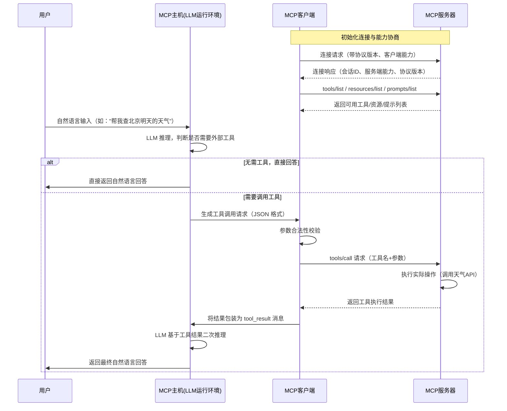

# MCP (Model Context Protocol) 技术文档

## 一、MCP 概述
### 1. 什么是 MCP
- **全称**：Model Context Protocol（模型上下文协议）
- **定位**：大语言模型与外部系统交互的标准化协议，让 LLM 能在上下文之外按统一格式访问外部数据、调用插件、持久化状态
- **核心价值**：解决不同 AI 框架（LangChain、LlamaIndex 等）工具调用规范不互通的问题，类似 Web 领域的 HTTP 协议，是 AI 生态的"公共语言"

### 2. 解决的痛点
- 以前每家 AI 框架都有自己的工具调用/记忆规范，生态碎片化严重
- 企业内部系统对接大模型需要重复开发适配层
- 工具和数据源无法在不同模型/框架间复用
- 缺乏统一的安全、权限、审计标准

## 二、核心架构与概念
### 1. 三层架构
```
┌─────────────────┐
│   MCP 主机(Host)│  运行 LLM 的环境（聊天机器人、AI 助手平台）
└─────────┬───────┘
          │
┌─────────▼───────┐
│  MCP 客户端(Client) │  协议封装、工具发现、结果解析
└─────────┬───────┘
          │
┌─────────▼───────┐
│  MCP 服务器(Server)│  连接外部资源的枢纽，提供工具/资源/提示服务
└─────────────────┘
```

### 2. 核心概念
| 概念 | 作用 | 示例 |
|------|------|------|
| **Tools（工具）** | 可调用的外部函数或 API，带参数 schema | 天气查询、数据库操作、文件写入 |
| **Resources（资源）** | 模型可直接访问的数据 | 文件系统、知识库、传感器数据、API 接口 |
| **Prompts（提示）** | 可复用的 prompt 模板 | 数据分析指令、客服对话脚本、周报生成模板 |
| **Sessions（会话）** | 一次上下文交互的生命周期 | 包含用户消息、模型回复、工具调用记录 |
| **Capabilities（能力）** | 服务端声明支持的功能集 | 是否支持资源订阅、实时推送、批量操作 |

### 3. 协议特性
- 基于 JSON-RPC 2.0 规范，支持双向流通信
- 传输层支持 WebSocket、HTTP SSE、gRPC 多种协议
- 内置版本协商和能力发现机制
- 统一的错误处理和状态码定义
- 支持会话级别的上下文持久化

## 三、完整交互流程
### 1. 基础交互时序图


### 2. 详细步骤拆解
#### 阶段1：初始化与能力协商
1. **连接建立**：MCP 客户端与服务器建立传输层连接（WebSocket/SSE）
2. **版本协商**：双方交换支持的 MCP 协议版本，确保兼容性
3. **能力声明**：服务器声明支持的功能集（工具、资源、提示等）
4. **元数据同步**：客户端拉取完整的工具/资源/提示元数据，缓存到本地

#### 阶段2：用户请求处理
1. **输入接收**：用户输入（文字/语音）传递到 MCP 主机
2. **上下文组装**：MCP 客户端将用户输入 + 工具描述 + 历史上下文组装成 LLM 输入
3. **LLM 推理**：模型判断是否需要外部工具支持
   - 无需工具：直接生成回答返回给用户
   - 需要工具：生成结构化的工具调用请求

#### 阶段3：工具调用与结果处理
1. **请求校验**：MCP 客户端校验工具调用的参数合法性、权限
2. **服务调用**：客户端向服务器发起工具/资源调用请求
3. **执行逻辑**：服务器执行实际操作（调用第三方 API、查询数据库、读写文件等）
4. **结果返回**：服务器返回标准化的 JSON 格式结果
5. **二次推理**：客户端将工具结果返回给 LLM，模型基于新信息生成最终回答
6. **响应输出**：主机将最终回答返回给用户

## 四、协议消息格式
### 1. 基础消息结构
所有消息都遵循 JSON-RPC 2.0 规范：
```json
{
  "jsonrpc": "2.0",
  "id": "请求唯一标识",
  "method": "方法名",
  "params": "参数对象"
}
```

### 2. 常用方法示例
#### 2.1 获取工具列表
**请求**
```json
{
  "jsonrpc": "2.0",
  "id": "req_001",
  "method": "tools/list"
}
```

**响应**
```json
{
  "jsonrpc": "2.0",
  "id": "req_001",
  "result": {
    "tools": [
      {
        "name": "get_weather",
        "description": "查询指定城市的天气信息",
        "input_schema": {
          "type": "object",
          "properties": {
            "city": {"type": "string", "description": "城市名称"},
            "date": {"type": "string", "description": "日期，格式YYYY-MM-DD"}
          },
          "required": ["city"]
        }
      }
    ]
  }
}
```

#### 2.2 调用工具
**请求**
```json
{
  "jsonrpc": "2.0",
  "id": "req_002",
  "method": "tools/call",
  "params": {
    "name": "get_weather",
    "arguments": {
      "city": "北京",
      "date": "2026-03-12"
    }
  }
}
```

**响应**
```json
{
  "jsonrpc": "2.0",
  "id": "req_002",
  "result": {
    "city": "北京",
    "date": "2026-03-12",
    "weather": "晴",
    "temperature": "8~18℃",
    "wind": "北风3级"
  }
}
```

#### 2.3 读取资源
**请求**
```json
{
  "jsonrpc": "2.0",
  "id": "req_003",
  "method": "resources/read",
  "params": {
    "uri": "file:///data/report/2026_q1.md"
  }
}
```

#### 2.4 获取提示模板
**请求**
```json
{
  "jsonrpc": "2.0",
  "id": "req_004",
  "method": "prompts/get",
  "params": {
    "name": "weekly-report-generator",
    "variables": {
      "department": "技术部",
      "week": "10"
    }
  }
}
```

## 五、项目实现案例
### 案例1：智能客服机器人
#### 1. 项目架构
```
用户 ↔ 微信小程序 ↔ MCP主机（豆包大模型） ↔ MCP客户端 ↔ MCP服务器
                                                         ↳ 工具1：订单查询API
                                                         ↳ 工具2：售后工单系统
                                                         ↳ 工具3：知识库检索
                                                         ↳ 资源1：用户信息数据库
```

#### 2. 交互流程示例
1. 用户发送："我的订单什么时候发货？"
2. LLM 识别需要调用订单查询工具，参数：用户ID+订单号
3. MCP 客户端调用服务器的 `order/query` 工具
4. 服务器返回订单状态："已发货，快递单号SF123456789，预计明天送达"
5. LLM 组织语言返回给用户："您的订单已于今天上午发货，快递单号SF123456789，预计明天送达，请注意查收~"

#### 3. 核心代码实现（Python 客户端）
```python
from mcp import ClientSession, StdioServerParameters
import asyncio
import json

async def chatbot_demo():
    # 1. 配置MCP服务器
    server_params = StdioServerParameters(
        command="python",
        args=["mcp_server/customer_service.py"]
    )
    
    async with ClientSession(server_params) as session:
        # 2. 获取工具列表
        tools = await session.list_tools()
        print(f"可用工具: {[t.name for t in tools]}")
        
        # 3. 用户输入
        user_input = "我的订单什么时候发货？"
        user_id = "user_123456"
        
        # 4. 调用LLM判断是否需要工具
        llm_response = call_llm(f"""
        用户问题：{user_input}
        用户ID：{user_id}
        可用工具：{json.dumps([t.model_dump() for t in tools])}
        如果需要调用工具，请返回JSON格式的工具调用请求，否则直接回答。
        """)
        
        # 5. 解析工具调用
        if is_tool_call(llm_response):
            tool_call = parse_tool_call(llm_response)
            # 6. 调用MCP工具
            result = await session.call_tool(
                tool_call.name,
                tool_call.arguments
            )
            # 7. 二次推理生成最终回答
            final_response = call_llm(f"""
            用户问题：{user_input}
            工具返回结果：{json.dumps(result)}
            请基于工具结果生成自然语言回答。
            """)
            print(f"客服回答：{final_response}")
        else:
            print(f"客服回答：{llm_response}")

if __name__ == "__main__":
    asyncio.run(chatbot_demo())
```

#### 4. MCP 服务器实现（Python）
```python
from mcp.server import Server
from mcp.types import Tool, TextContent
import asyncio

# 初始化服务器
server = Server("customer-service-server")

# 定义工具
@server.tool()
async def query_order(user_id: str, order_id: str = None) -> str:
    """
    查询用户订单状态
    :param user_id: 用户ID，必填
    :param order_id: 订单号，可选，不填则返回最近订单
    """
    # 实际业务逻辑：查询订单数据库
    order_info = {
        "order_id": "ORD20260311001",
        "status": "已发货",
        "tracking_number": "SF123456789",
        "estimated_delivery": "2026-03-12",
        "products": ["无线耳机", "手机壳"]
    }
    return json.dumps(order_info, ensure_ascii=False)

@server.tool()
async def create_ticket(user_id: str, content: str, type: str) -> str:
    """创建售后工单"""
    # 工单创建逻辑
    ticket_id = "TK" + str(int(time.time()))
    return f"工单已创建，工单号：{ticket_id}，我们会在24小时内处理"

# 运行服务器
if __name__ == "__main__":
    asyncio.run(server.run_stdio())
```

### 案例2：企业级知识库助手
#### 1. 架构特点
- MCP 服务器对接企业内部 Confluence、GitLab、数据库等多数据源
- 实现统一的权限控制，确保敏感数据只在授权范围内访问
- 支持增量同步，知识库更新后实时生效
- 内置审计日志，记录所有工具调用和数据访问记录

#### 2. 核心优势
- 无需修改大模型代码，只需在 MCP 服务器新增数据源即可
- 所有数据访问都经过统一的安全网关，符合企业合规要求
- 工具可以在不同业务线的 AI 应用间复用，避免重复开发

## 六、部署与最佳实践
### 1. 部署模式
#### 模式1：单服务器单客户端
```
适合小型应用、个人项目
LLM应用 ↔ MCP客户端 ↔ MCP服务器 ↔ 少量工具/数据源
```

#### 模式2：多服务器多客户端
```
适合企业级场景
┌────────────┐   ┌────────────┐
│  客服机器人  │   │  代码助手   │
└──────┬─────┘   └──────┬─────┘
       │                │
┌──────▼────────────────▼─────┐
│        MCP 网关层            │  负载均衡、权限控制、审计
└──────┬────────────────┬─────┘
       │                │
┌──────▼─────┐   ┌──────▼─────┐
│  业务工具集  │   │  数据资源集 │
└────────────┘   └────────────┘
```

### 2. 最佳实践
1. **工具粒度设计**：工具粒度适中，避免过于庞大或过于细碎，建议每个工具完成单一职责
2. **错误处理**：工具返回标准化的错误信息，包含错误码、错误描述、可重试标识
3. **缓存策略**：对不常变更的资源（如知识库文档）进行缓存，减少重复调用开销
4. **限流降级**：设置工具调用的 QPS 限制，防止外部 API 被打垮
5. **可观测性**：埋点记录所有工具调用的耗时、成功率、参数，便于排查问题
6. **安全控制**：
   - 工具调用前校验用户权限
   - 敏感数据脱敏后再返回给 LLM
   - 高危操作（如文件删除、数据修改）需要二次确认

### 3. 适用场景
- 企业内部知识库接入大模型
- 智能客服系统对接业务后台
- AI 编程助手对接代码仓库、CI/CD 系统
- 多模态 AI 应用对接摄像头、传感器等硬件设备
- 跨模型/跨框架的工具生态共享

## 七、生态与发展
### 1. 主流实现
- **官方 SDK**：Python、TypeScript、Java 等多语言 SDK
- **框架集成**：LangChain、LlamaIndex、AutoGPT 等主流 AI 框架已内置 MCP 支持
- **服务端实现**：开源的 MCP 服务器框架，支持快速开发自定义工具集
- **工具市场**：已有大量开箱即用的 MCP 工具包，覆盖常见 API、数据库、SaaS 服务

### 2. 与传统 Function Calling 的区别
| 特性 | MCP | 传统 Function Calling |
|------|-----|----------------------|
| 生态兼容性 | 跨模型、跨框架通用 | 通常是特定厂商（如 OpenAI）的专属实现 |
| 功能丰富度 | 支持工具、资源、提示、会话管理 | 仅支持单次工具调用 |
| 状态管理 | 内置会话级状态持久化 | 无状态，需要应用层自行管理 |
| 能力发现 | 支持动态工具发现和版本协商 | 工具列表需要提前静态定义 |
| 传输层 | 支持双向流、实时推送 | 仅支持请求-响应模式 |

### 3. 未来发展方向
- 支持更丰富的资源类型（流媒体、二进制数据）
- 内置联邦学习能力，支持跨机构数据协同
- 优化低延迟场景，支持实时交互应用
- 标准化的工具市场和分发机制
- 更完善的安全和隐私保护机制
