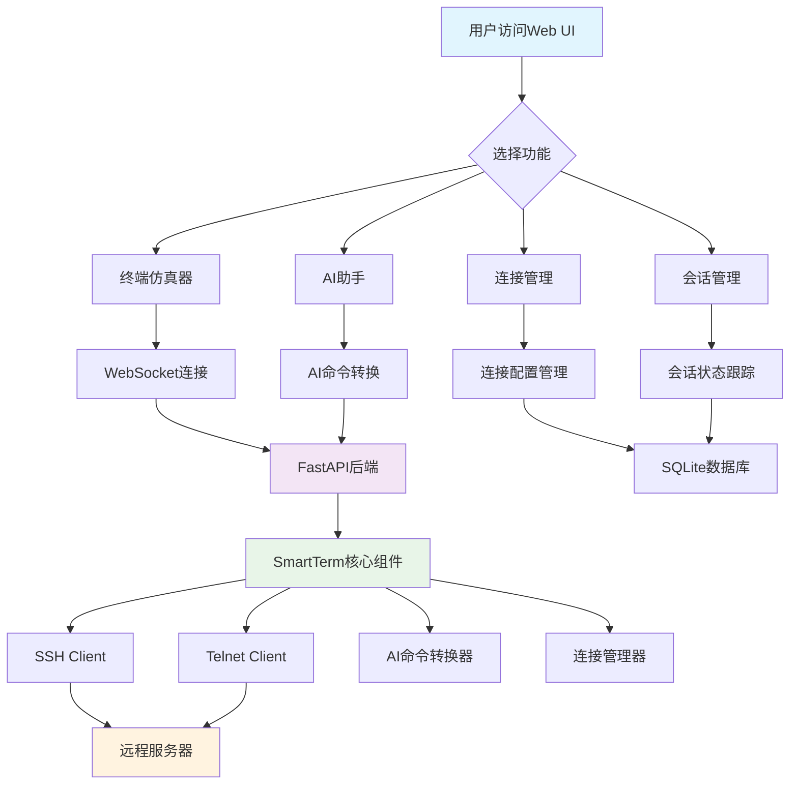

```mermaid
graph TD
    A[用户访问Web UI] --> B{选择功能}
    B --> C[终端仿真器]
    B --> D[AI助手]
    B --> E[连接管理]
    B --> F[会话管理]

    C --> G[WebSocket连接]
    D --> H[AI命令转换]
    E --> I[连接配置管理]
    F --> J[会话状态跟踪]

    G --> K[FastAPI后端]
    H --> K
    I --> L[SQLite数据库]
    J --> L

    K --> M[SmartTerm核心组件]
    M --> N[SSH Client]
    M --> O[Telnet Client]
    M --> P[AI命令转换器]
    M --> Q[连接管理器]

    N --> R[远程服务器]
    O --> R

    style A fill:#e1f5fe
    style K fill:#f3e5f5
    style M fill:#e8f5e8
    style R fill:#fff3e0
```