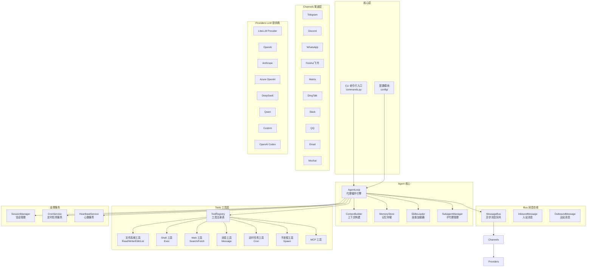
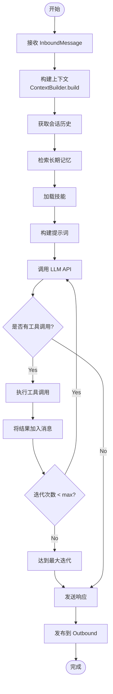

# Nanobot 项目学习指南

## 项目概述

**Nanobot** 是一个超轻量级的个人 AI 助手框架，由香港大学开发维护。该项目以极简的代码量（约 4000 行核心代码）实现了完整的 AI Agent 功能，相比 OpenClaw 减少了 99% 的代码量。

**项目特点：**
- Ultra-Lightweight: 仅约 4000 行核心代码
- Research-Ready: 清晰易读的代码，易于理解和扩展
- Lightning Fast: 极低的资源占用和快速启动
- Easy-to-Use: 一键部署即可使用

---

## 一、项目架构思维导图



---

## 二、核心流程图

### 2.1 消息处理流程

```mermaid
sequenceDiagram
    participant User as 用户
    participant Channel as 聊天渠道
    participant Bus as MessageBus
    participant Agent as AgentLoop
    participant Provider as LLM Provider
    participant Tools as ToolRegistry

    User->>Channel: 发送消息
    Channel->>Channel: 权限校验

    alt 权限校验通过
        Channel->>Bus: publish_inbound(InboundMessage)
        Bus->>Agent: consume_inbound()

        Agent->>Agent: 构建上下文<br/>ContextBuilder.build()
        Agent->>Agent: 获取会话历史<br/>SessionManager.get_session()
        Agent->>Agent: 检索记忆<br/>MemoryStore.search()

        loop Agent Loop (max 40 iterations)
            Agent->>Provider: chat(messages, tools)
            Provider-->>Agent: LLMResponse

            alt 有 Tool Calls
                Agent->>Tools: 执行工具调用
                Tools-->>Agent: tool_result
                Agent->>Agent: 将结果加入消息历史
            else 无 Tool Calls
                Agent->>Bus: publish_outbound(OutboundMessage)
                Bus->>Channel: consume_outbound()
                Channel-->>User: 发送回复
                break 退出循环
            end
        end

    else 权限校验失败
        Channel-->>User: 拒绝访问
    end
```

### 2.2 Agent Loop 核心循环



---

## 三、模块详解

### 3.1 Agent 模块 (`nanobot/agent/`)

**核心组件：**

| 文件 | 功能 | 核心类 |
|------|------|--------|
| `loop.py` | Agent 核心循环引擎 | `AgentLoop` |
| `context.py` | 上下文构建器 | `ContextBuilder` |
| `memory.py` | 记忆存储系统 | `MemoryStore` |
| `skills.py` | 技能加载器 | `SkillsLoader` |
| `subagent.py` | 子代理管理 | `SubagentManager` |

**AgentLoop 核心逻辑：**
```python
class AgentLoop:
    async def run(self):
        msg = await self.bus.consume_inbound()
        session = self.sessions.get_or_create(msg.session_key)

        for iteration in range(self.max_iterations):
            # 1. 构建上下文
            context = await self.context.build(...)

            # 2. 调用 LLM
            response = await self.provider.chat(
                messages=context.messages,
                tools=self.tools.definitions
            )

            # 3. 处理工具调用
            if response.has_tool_calls:
                for tool_call in response.tool_calls:
                    result = await self.tools.execute(tool_call)
                    context.add_result(tool_call.id, result)
            else:
                # 4. 发送响应
                await self.bus.publish_outbound(...)
                break
```

### 3.2 Channels 模块 (`nanobot/channels/`)

**支持的渠道：**

| 渠道 | 文件 | 通信方式 | 依赖 |
|------|------|----------|------|
| Telegram | `telegram.py` | Webhook/Long Polling | python-telegram-bot |
| Discord | `discord.py` | WebSocket/Gateway | slack-sdk |
| WhatsApp | `whatsapp.py` | WebSocket (Baileys) | Node.js bridge |
| Feishu | `feishu.py` | WebSocket | lark-oapi |
| Matrix | `matrix.py` | WebSocket | matrix-nio |
| DingTalk | `dingtalk.py` | Stream Mode | dingtalk-stream |
| Slack | `slack.py` | Socket Mode | slack-sdk |
| QQ | `qq.py` | WebSocket | botpy |
| Email | `email.py` | IMAP/SMTP | 内置 |
| Mochat | `mochat.py` | Socket.IO | python-socketio |

**BaseChannel 接口：**
```python
class BaseChannel(ABC):
    name: str

    def __init__(self, config, bus: MessageBus):
        self.bus = bus

    @abstractmethod
    async def start(self) -> None:
        """启动渠道，连接聊天平台"""

    @abstractmethod
    async def stop(self) -> None:
        """停止渠道"""

    @abstractmethod
    async def send(self, msg: OutboundMessage) -> None:
        """发送消息到聊天平台"""

    async def _handle_message(self, sender_id, chat_id, content, ...):
        """处理收到的消息，发送到 MessageBus"""
```

### 3.3 Providers 模块 (`nanobot/providers/`)

**支持的 LLM 提供商：**

| 提供商 | 文件 | 特点 |
|--------|------|------|
| LiteLLM | `litellm_provider.py` | 统一接口，支持 100+ 模型 |
| OpenAI | 内置 litellm | GPT-4, GPT-4o |
| Anthropic | 内置 litellm | Claude 系列 |
| Azure OpenAI | `azure_openai_provider.py` | 企业级部署 |
| DeepSeek | 内置 litellm | 推理模型 |
| Qwen | 内置 litellm | 阿里通义 |
| OpenAI Codex | `openai_codex_provider.py` | 代码生成，OAuth |
| Custom | `custom_provider.py` | 自定义 API |

**LLMProvider 接口：**
```python
class LLMProvider(ABC):
    @abstractmethod
    async def chat(
        self,
        messages: list[dict],
        tools: list[dict] | None = None,
        model: str | None = None,
        max_tokens: int = 4096,
        temperature: float = 0.7,
    ) -> LLMResponse:
        """发送聊天完成请求"""

    @abstractmethod
    def get_default_model(self) -> str:
        """获取默认模型"""
```

### 3.4 Tools 模块 (`nanobot/agent/tools/`)

**内置工具：**

| 工具 | 文件 | 功能 |
|------|------|------|
| ReadFile | `filesystem.py` | 读取文件内容 |
| WriteFile | `filesystem.py` | 写入文件 |
| EditFile | `filesystem.py` | 编辑文件 |
| ListDir | `filesystem.py` | 列出目录 |
| Exec | `shell.py` | 执行 Shell 命令 |
| WebSearch | `web.py` | 网页搜索 (Brave) |
| WebFetch | `web.py` | 获取网页内容 |
| Message | `message.py` | 发送消息 |
| Cron | `cron.py` | 定时任务管理 |
| Spawn | `spawn.py` | 启动子进程 |
| MCP | `mcp.py` | MCP 工具集成 |

### 3.5 Bus 模块 (`nanobot/bus/`)

**消息总线架构：**
```python
class MessageBus:
    def __init__(self):
        self.inbound: asyncio.Queue[InboundMessage]
        self.outbound: asyncio.Queue[OutboundMessage]

    async def publish_inbound(self, msg: InboundMessage):
        """渠道 -> Agent"""

    async def publish_outbound(self, msg: OutboundMessage):
        """Agent -> 渠道"""
```

---

## 四、技术栈

### 4.1 核心依赖

```
typer>=0.20.0          # CLI 框架
litellm>=1.81.5       # LLM 统一接口
pydantic>=2.12.0      # 数据验证
websockets>=16.0      # WebSocket 支持
httpx>=0.28.0         # HTTP 客户端
loguru>=0.7.3         # 日志
rich>=14.0.0          # 终端美化
croniter>=6.0.0       # Cron 解析
mcp>=1.26.0           # MCP 协议
```

### 4.2 渠道特定依赖

```
python-telegram-bot    # Telegram
slack-sdk              # Discord/Slack
lark-oapi              # 飞书
dingtalk-stream        # 钉钉
botpy                  # QQ
matrix-nio             # Matrix
python-socketio        # Mochat/WhatsApp
```

---

## 五、学习路线

### 阶段一：入门基础 (1-2 天)

**目标：** 理解项目结构和运行机制

1. **环境搭建**
   ```bash
   git clone https://github.com/HKUDS/nanobot.git
   cd nanobot
   pip install -e .
   ```

2. **运行项目**
   ```bash
   nanobot onboard           # 初始化配置
   nanobot agent             # 启动 CLI 模式
   nanobot gateway           # 启动网关（连接渠道）
   ```

3. **阅读文档**
   - README.md 完整阅读
   - 理解项目架构图

4. **核心文件阅读顺序：**
   - `nanobot/__main__.py` - 入口点
   - `nanobot/cli/commands.py` - CLI 命令
   - `pyproject.toml` - 依赖和项目配置

### 阶段二：核心机制 (3-5 天)

**目标：** 掌握 Agent 核心循环

1. **Message Bus**
   - 阅读 `nanobot/bus/queue.py`
   - 理解入站/出站消息队列
   - 理解解耦架构

2. **Agent Loop**
   - 阅读 `nanobot/agent/loop.py` 全文
   - 理解核心循环逻辑
   - 理解工具调用流程

3. **Context 构建**
   - 阅读 `nanobot/agent/context.py`
   - 理解上下文如何构建
   - 理解消息历史管理

4. **Session 管理**
   - 阅读 `nanobot/session/manager.py`
   - 理解会话隔离
   - 理解会话历史存储

### 阶段三：工具系统 (2-3 天)

**目标：** 理解工具注册和执行

1. **Tool Registry**
   - 阅读 `nanobot/agent/tools/registry.py`
   - 理解工具定义格式
   - 理解工具执行机制

2. **基础工具实现**
   - 阅读 `nanobot/agent/tools/filesystem.py`
   - 阅读 `nanobot/agent/tools/shell.py`
   - 理解工具接口设计

3. **MCP 集成**
   - 阅读 `nanobot/agent/tools/mcp.py`
   - 理解 MCP 协议集成

### 阶段四：渠道集成 (3-5 天)

**目标：** 理解多渠道消息接入

1. **Base Channel**
   - 阅读 `nanobot/channels/base.py`
   - 理解渠道抽象接口

2. **示例渠道**
   - 选择一个简单渠道阅读（如 Telegram）
   - `nanobot/channels/telegram.py`
   - 理解消息接收和发送机制

3. **权限控制**
   - 理解 `allowFrom` 机制
   - 理解会话隔离

### 阶段五：LLM 提供商 (2-3 天)

**目标：** 理解多模型支持

1. **Provider 接口**
   - 阅读 `nanobot/providers/base.py`
   - 理解统一接口设计

2. **LiteLLM Provider**
   - 阅读 `nanobot/providers/litellm_provider.py`
   - 理解如何统一 100+ 模型

3. **注册机制**
   - 阅读 `nanobot/providers/registry.py`
   - 理解动态模型注册

### 阶段六：高级功能 (3-5 天)

**目标：** 掌握高级特性

1. **记忆系统**
   - 阅读 `nanobot/agent/memory.py`
   - 理解长期记忆存储

2. **技能系统**
   - 阅读 `nanobot/agent/skills.py`
   - 理解动态技能加载

3. **定时任务**
   - 阅读 `nanobot/cron/service.py`
   - 理解 Cron 任务调度

4. **心跳服务**
   - 阅读 `nanobot/heartbeat/service.py`
   - 理解健康检查机制

---

## 六、实践建议

### 6.1 推荐学习顺序

```
1. 运行项目 -> 2. CLI 入口 -> 3. MessageBus -> 4. AgentLoop
   -> 5. Tools -> 6. Channels -> 7. Providers -> 8. Session
```

### 6.2 动手实践

1. **添加新渠道：** 参考现有渠道实现
2. **添加新工具：** 参考现有工具实现
3. **添加新 Provider：** 参考 LiteLLM Provider
4. **修改 Agent 行为：** 修改 loop.py 中的逻辑

### 6.3 调试技巧

```python
# 开启详细日志
import nanobot
nanobot.configure(..., log_level="DEBUG")

# 本地测试
nanobot agent  # CLI 模式
```

---

## 七、关键代码片段

### 7.1 消息流转

```python
# 渠道接收到消息
await self.bus.publish_inbound(InboundMessage(
    channel="telegram",
    sender_id="123",
    chat_id="456",
    content="Hello"
))

# Agent 处理消息
msg = await self.bus.consume_inbound()

# Agent 发送响应
await self.bus.publish_outbound(OutboundMessage(
    channel="telegram",
    chat_id="456",
    content="Hi there!"
))
```

### 7.2 工具调用

```python
# 定义工具
tool = {
    "name": "read_file",
    "description": "读取文件内容",
    "parameters": {
        "type": "object",
        "properties": {
            "path": {"type": "string"}
        }
    }
}

# LLM 返回工具调用
tool_call = ToolCallRequest(
    id="call_123",
    name="read_file",
    arguments={"path": "/tmp/test.txt"}
)

# 执行工具
result = await registry.execute(tool_call)
```

---

## 八、参考资料

- [Nanobot GitHub](https://github.com/HKUDS/nanobot)
- [LiteLLM 文档](https://docs.litellm.ai/)
- [Pydantic 文档](https://docs.pydantic.dev/)
- [Typer 文档](https://typer.tiangolo.com/)

---

*本学习指南基于 nanobot v0.1.4.post4 版本生成*
