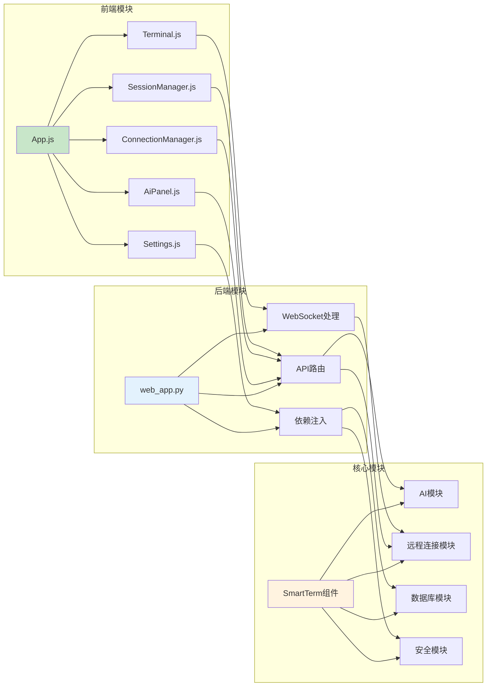

```mermaid
graph LR
    subgraph "前端模块"
        A[App.js]
        A --> B[Terminal.js]
        A --> C[AiPanel.js]
        A --> D[ConnectionManager.js]
        A --> E[SessionManager.js]
        A --> F[Settings.js]
    end

    subgraph "后端模块"
        G[web_app.py]
        G --> H[API路由]
        G --> I[WebSocket处理]
        G --> J[依赖注入]
    end

    subgraph "核心模块"
        K[SmartTerm组件]
        K --> L[AI模块]
        K --> M[远程连接模块]
        K --> N[数据库模块]
        K --> O[安全模块]
    end

    B --> I
    C --> H
    D --> H
    E --> H
    F --> J

    H --> L
    H --> M
    I --> M
    J --> N
    J --> O

    style A fill:#c8e6c9
    style G fill:#e3f2fd
    style K fill:#fff3e0
```