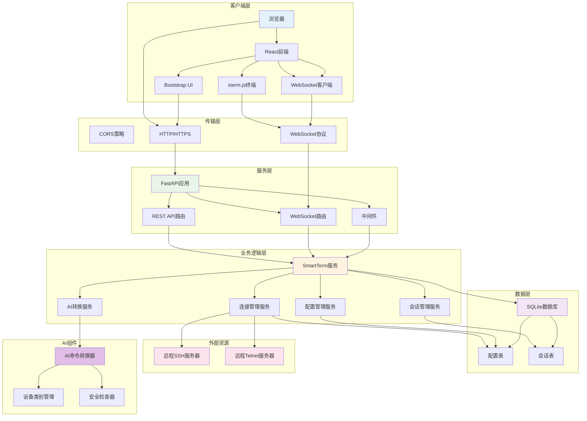

```mermaid
graph TB
    subgraph "客户端层"
        A[浏览器]
        A --> B[React前端]
        B --> C[xterm.js终端]
        B --> D[Bootstrap UI]
        B --> E[WebSocket客户端]
    end

    subgraph "传输层"
        F[CORS策略]
        G[HTTP/HTTPS]
        H[WebSocket协议]
    end

    subgraph "服务层"
        I[FastAPI应用]
        I --> J[REST API路由]
        I --> K[WebSocket路由]
        I --> L[中间件]
    end

    subgraph "业务逻辑层"
        M[SmartTerm服务]
        M --> N[连接管理服务]
        M --> O[会话管理服务]
        M --> P[AI转换服务]
        M --> Q[配置管理服务]
    end

    subgraph "数据层"
        R[SQLite数据库]
        S[配置表]
        T[会话表]
    end

    subgraph "外部资源"
        U[远程SSH服务器]
        V[远程Telnet服务器]
    end

    subgraph "AI组件"
        W[AI命令转换器]
        X[设备类别管理]
        Y[安全检查器]
    end

    A --> G
    B --> E
    C --> H
    D --> G
    E --> H

    G --> I
    H --> K
    J --> M
    K --> M
    L --> M

    M --> R
    N --> S
    O --> T
    P --> W
    Q --> S

    R --> S
    R --> T

    N --> U
    N --> V

    W --> X
    W --> Y

    style A fill:#e3f2fd
    style I fill:#e8f5e8
    style M fill:#fff3e0
    style R fill:#f3e5f5
    style U fill:#fce4ec
    style V fill:#fce4ec
    style W fill:#e1bee7
```